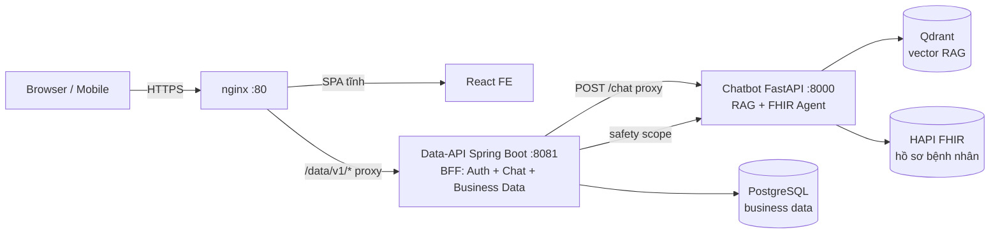

# 🫀 HeCA — Health Care Assistant

> Trợ lý Chăm sóc Khách hàng AI cho **Bệnh viện Tim Hà Nội** — trả lời chính xác từ nguồn chính thức, giảm tải tổng đài/reception 24/7, phát hiện dấu hiệu cấp cứu.

**VAIC 2026 — Vietnam AI Innovation Challenge** · Đề tài: *Intelligent AI Customer Care Assistant for Hanoi Heart Hospital*


---

## 🌐 Demo trực tiếp

| | |
|---|---|
| **URL** | https://heca.tolalinhne.site |
| **Tài khoản demo** | `minh.khang001@example.vn` · `BvTim@2026` *(môi trường demo)* |

**Thử nhanh:**
1. Đăng nhập bằng tài khoản demo.
2. Chat: *"kết quả xét nghiệm của tôi"* → trả **dữ liệu y tế cá nhân** (huyết áp, nhịp tim, glucose, HbA1c...) từ FHIR.
3. Chat ẩn danh: *"kết quả xét nghiệm của tôi"* → từ chối an toàn + điều hướng đăng nhập.
4. Chat chung: *"giới thiệu bệnh viện"*, *"BHYT khám tim mạch thế nào"* → trả lời RAG có trích nguồn.
5. Cấp cứu: *"tôi bị đau ngực dữ dội khó thở"* → chuyển khoa Cấp cứu / 115.

---

## ❓ HeCA là gì

**Vấn đề** — Bệnh viện Tim Hà Nội đón **2.500–3.000 bệnh nhân ngoại trú/ngày**, tạo khối lượng câu hỏi lặp khổng lồ làm quá tải tổng đài/reception qua nhiều kênh (điện thoại, web, fanpage). Bệnh nhân/người nhà không nhận diện được dấu hiệu nguy hiểm → chậm chuyển cấp cứu.

**Giải pháp** — Trợ lý hội thoại AI **grounding trên nguồn chính thức** (website BV + Quy trình `QT.25.01`), không bịa đặt, trích dẫn nguồn, và có **kill switch cấp cứu** chuyển khoa Cấp cứu kịp thời.

---

## ✨ Tính năng chính

- **💬 Hỏi đáp grounding + trích nguồn** — chính sách, thủ tục, BHYT, giá dịch vụ, lịch bác sĩ, kênh đặt khám.
- **🩺 Dữ liệu y tế cá nhân (FHIR)** — bệnh nhân đăng nhập hỏi *"kết quả xét nghiệm / đơn thuốc / hồ sơ của tôi"* → trả dữ liệu thật, được phân quyền chặt (scope theo user→patient).
- **🚨 Triage cấp cứu (kill switch)** — nhận diện dấu hiệu nguy hiểm → KHÔNG tư vấn, chuyển Cấp cứu/115.
- **🔎 Guardrail theo lớp** — intent router → emergency triage → refusal/out-of-scope → no-medical-advice.
- **🇻🇳 Tiếng Việt có dấu** — xử lý teencode, tên bác sĩ + ngày ("lịch bác sĩ tim mạch ngày 16/7").
- **📱 Responsive** — tối ưu mobile, handoff sang kênh người (hotline) khi AI hết khả năng.

---

## 🏗️ Kiến trúc



**3 backend tách lớp, swappable:**
- **Data-API (Spring Boot)** — BFF sở hữu auth, persistence chat, dữ liệu nghiệp vụ cấu trúc (khoa, bác sĩ, lịch, giá, BHYT...). Prod → adapter gọi HIS thật.
- **Chatbot (FastAPI)** — RAG pipeline + agent FHIR + guardrail. Điểm giao thoa FE↔AI duy nhất = API contract.
- **FHIR (HAPI)** — hồ sơ y tế bệnh nhân, truy cập có phân quyền.

---

## 🧰 Tech Stack

| Lớp | Công nghệ |
|---|---|
| **Frontend** | React 18 + Create React App, responsive, chat UI y tế |
| **Data-API** | Java 21 + Spring Boot 3, Spring Data JPA, PostgreSQL, Flyway, JWT auth |
| **Chatbot** | Python 3.12 + FastAPI, LangGraph, Qdrant, BGE-M3/reranker, LLM cloud API |
| **FHIR** | HAPI FHIR Server + PostgreSQL (hồ sơ bệnh nhân) |
| **Infra** | Docker Compose, GHCR, GitHub Actions CI/CD, nginx reverse proxy |
| **Test** | JUnit (data-api), pytest (chatbot) |

---

## 📂 Cấu trúc Repository

```
.
├── frontend/          # React SPA (chat UI y tế)
├── data-api/          # Spring Boot — BFF + business data + chat persistence
├── chatbot-service/   # FastAPI — RAG + FHIR agent + guardrail
│   ├── graph/         # LangGraph nodes (router, emergency, fhir, answer...)
│   ├── fhir/          # FHIR tools + planner + formatter
│   ├── public_tools/  # tra cứu công khai (giá, lịch, BHYT...)
│   └── llm/           # router + answer generator
├── infra/hapi-fhir/   # HAPI FHIR server + seed scripts
├── deploy/            # build & deploy scripts
├── docs/              # tài liệu dự án (PDR, kiến trúc, API, deploy...)
└── .github/workflows/ # CI/CD
```

---

## 🚀 Quick Start

### Yêu cầu
- Docker + Docker Compose
- (Chatbot) file `chatbot-service/.env` với `OPENAI_API_KEY` + `FHIR_BASE_URL`

### Chạy backend stack
```bash
cp .env.example .env            # cấu hình DB, secrets
docker compose up -d            # postgres + data-api + chatbot
```

### HAPI FHIR (dữ liệu bệnh nhân, chạy riêng)
```bash
docker compose -f infra/hapi-fhir/docker-compose.yml up -d
python infra/hapi-fhir/scripts/wait_for_hapi.py
python infra/hapi-fhir/scripts/seed_fhir_data.py
```

### Frontend (dev)
```bash
cd frontend && npm ci && npm start    # http://localhost:3000
```

Chi tiết deploy VPS: [`docs/09-deployment-guide.md`](docs/09-deployment-guide.md).

---

## 🔧 Cấu hình (env chính)

| Biến | Mô tả |
|---|---|
| `DB_USER` / `DB_PASS` / `DB` | PostgreSQL credentials (data-api) |
| `JWT_SECRET` | ký access token |
| `OPENAI_API_KEY` | LLM cho chatbot router + answer |
| `FHIR_BASE_URL` | HAPI FHIR endpoint (chatbot) |
| `DATA_API_BASE_URL` | data-api base (chatbot public tools) |

> Không commit secrets. Dùng `.env` (đã `.gitignore`) hoặc `docker-compose.override.yml` (local-only).

---

## 🔌 API (tóm tắt)

| Endpoint | Mô tả |
|---|---|
| `POST /data/v1/auth/login` | đăng nhập (`identifier` = email/SĐT + `password`) → JWT |
| `POST /data/v1/auth/register` | đăng ký (auto-link patient FHIR) |
| `POST /data/v1/chat` | chat (anon OK; login → dữ liệu cá nhân) |
| `GET  /data/v1/chat/sessions` | lịch sử hội thoại |
| `GET  /data/v1/departments`, `/doctors`, `/service-prices`... | dữ liệu nghiệp vụ công khai |

Đặc tả đầy đủ: [`docs/07-api-design.md`](docs/07-api-design.md).

---

## 🧪 Testing

```bash
# Data-API (Java)
cd data-api && ./mvnw test

# Chatbot (Python)
cd chatbot-service && pytest
```

CI tự động: `test-data-api` + `test-chatbot` + build images + auto-deploy VPS trên push `develop`.

---

## 📚 Tài liệu dự án

Toàn bộ spec nằm trong [`docs/`](docs/):
- [`01-project-overview.md`](docs/01-project-overview.md) — tầm nhìn, scope, stack
- [`05-system-architecture.md`](docs/05-system-architecture.md) — kiến trúc chi tiết
- [`07-api-design.md`](docs/07-api-design.md) — API contract
- [`09-deployment-guide.md`](docs/09-deployment-guide.md) — deploy VPS
- [`10-development-roadmap.md`](docs/10-development-roadmap.md) — roadmap + pilot pathway

---

## 🗺️ Roadmap

- [x] MVP 48h: RAG grounded + guardrail + FHIR cá nhân + CI/CD + deploy VPS
- [ ] Tích hợp HIS/API thật (thay mock adapter)
- [ ] Zalo Mini App + tổng đài thật
- [ ] ASR/TTS tiếng Việt (PhoWhisper)
- [ ] Pilot production tại Bệnh viện Tim Hà Nội

---

## 👥 Team

Dự án VAIC 2026 — đội phát triển dùng AI agent (Claude Code) xuyên suốt chu trình research → plan → implement → test → review → deploy.

---

## 📄 License

MIT — xem [`LICENSE`](LICENSE).
