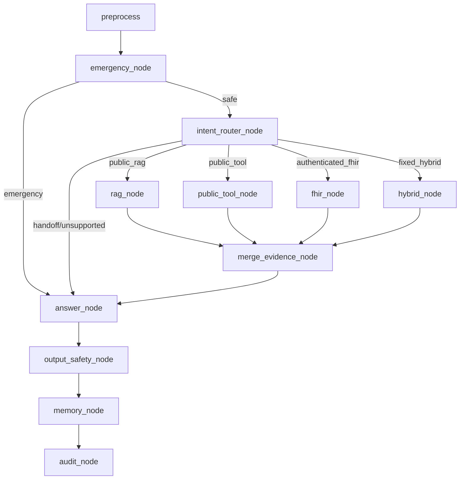

# Chatbot Service

Đây là skeleton backend cho chatbot AI chăm sóc khách hàng của Bệnh viện Tim Hà Nội.

Mục tiêu của skeleton này không phải là làm xong toàn bộ chatbot ngay từ đầu, mà là tạo một khung làm việc rõ ràng để nhiều người có thể code song song mà không giẫm lên phần của nhau.

## Bối Cảnh Dự Án

Chatbot cần hỗ trợ người bệnh và người nhà trong các nhóm việc chính:

- Hỏi đáp thông tin chính thức của bệnh viện bằng RAG.
- Hỏi quy trình khám, giấy tờ cần chuẩn bị, BHYT, giờ làm việc.
- Tra lịch bác sĩ, giá dịch vụ, kênh đặt lịch bằng public tool hoặc API có cấu trúc.
- Phát hiện tình huống có dấu hiệu cấp cứu và ưu tiên phản hồi an toàn.
- Về sau có thể truy xuất dữ liệu cá nhân qua FHIR/HIS khi người dùng đã xác thực.

Nguyên tắc quan trọng nhất:

- Không chẩn đoán.
- Không kê đơn.
- Không tư vấn thay đổi điều trị.
- Không bịa khi không có nguồn.
- Mọi câu trả lời nghiệp vụ phải dựa trên evidence.
- Emergency phải chạy trước RAG, FHIR và planner.

## Ai Làm Phần Nào

Trong team hiện tại có thể chia như sau:

- Người phụ trách RAG làm trong `rag/`.
- Người phụ trách FHIR làm trong `fhir/`.
- Người phụ trách tích hợp làm trong `graph/`, `api/`, `core/`.
- Người phụ trách safety làm trong `guardrails/`.
- Người phụ trách câu trả lời/model làm trong `llm/`.

Nếu chỉ có hai người:

- Người 1 làm FHIR: `fhir/`, một phần `graph/nodes/fhir_node.py`, test FHIR contract.
- Người 2 làm RAG: `rag/`, một phần `graph/nodes/rag_node.py`, test RAG contract.
- Cả hai không tự sửa `core/contracts.py` nếu chưa thống nhất.

## Cây Thư Mục

```text
chatbot-service/
  app/             # Khởi tạo FastAPI, config, logging
  api/             # HTTP API contract cho frontend/backend khác gọi vào
  core/            # Contract, enum, state dùng chung toàn hệ thống
  graph/           # LangGraph workflow và các node điều phối
  rag/             # Retrieval từ kho tri thức chính thức của bệnh viện
  fhir/            # Kết nối FHIR/HIS và kiểm soát dữ liệu cá nhân
  public_tools/    # Tool công khai: đặt lịch, lịch bác sĩ, giá dịch vụ
  guardrails/      # Emergency, chống prompt injection, safety output, permission
  llm/             # Model routing, prompt, answer generation
  memory/          # Session memory ngắn hạn, không lưu dữ liệu nhạy cảm
  observability/   # Audit log, metrics, monitoring
  tests/           # Unit test và contract test
```

Mỗi folder có README riêng. Nếu bạn chưa biết gì về dự án, hãy đọc theo thứ tự:

1. File này.
2. `core/README.md`.
3. `graph/README.md`.
4. `graph/nodes/README.md`.
5. Folder bạn phụ trách, ví dụ `rag/README.md` hoặc `fhir/README.md`.
6. `tests/README.md`.

## Luồng Graph Chung



Diễn giải đơn giản:

1. `preprocess`: làm sạch câu hỏi người dùng.
2. `emergency_node`: kiểm tra cấp cứu trước mọi thứ khác.
3. `intent_router_node`: chọn route nghiệp vụ.
4. `rag_node`, `public_tool_node`, `fhir_node`, `hybrid_node`: lấy evidence.
5. `merge_evidence_node`: gom evidence và citation.
6. `answer_node`: sinh câu trả lời có căn cứ.
7. `output_safety_node`: kiểm tra câu trả lời có an toàn không.
8. `memory_node`: lưu context ngắn hạn, không lưu raw medical data.
9. `audit_node`: ghi audit tối thiểu.

## Contract Bắt Buộc

Mọi nhánh retrieval đều phải trả về `Evidence` trong `core/contracts.py`.

Không trả string tùy ý từ RAG/FHIR/public tool. Graph chỉ hiểu dữ liệu theo contract chung.

Ví dụ node retrieval đúng:

```python
return {
    "evidence": [item.model_dump(mode="json") for item in evidence],
    "citations": [citation.model_dump(mode="json") for citation in citations],
}
```

Ví dụ node retrieval sai:

```python
return "Bệnh viện làm việc từ 7h đến 17h"
```

Sai vì graph không biết string này là nguồn gì, có citation không, confidence bao nhiêu, có hết hiệu lực không.

## Quy Tắc Khi Code

### RAG

- RAG chỉ lấy tài liệu chính thức đã được duyệt.
- RAG phải có citation.
- RAG không tự trả lời người dùng.
- RAG không dùng tài liệu hết hiệu lực, deprecated hoặc không thuộc nguồn chính thức.

### FHIR

- FHIR chỉ dùng cho dữ liệu cá nhân khi người dùng đã xác thực.
- Không tin `patient_id` người dùng nhập để truy cập dữ liệu.
- Patient ID phải lấy từ token, identity mapping hoặc `allowed_patient_ids`.
- Không gửi raw FHIR đầy đủ vào prompt nếu không cần.

### Graph

- Graph không chứa logic chi tiết của RAG/FHIR.
- Graph chỉ điều phối, kiểm tra route, merge evidence, gọi answer và safety.
- Planner động chưa phải MVP. Ưu tiên fixed workflow.

### Safety

- Emergency là kill switch.
- Nếu phát hiện cấp cứu, không RAG, không FHIR, không giải thích bệnh dài dòng.
- Nếu thiếu evidence, fallback an toàn.
- Nếu câu trả lời có dấu hiệu tư vấn điều trị, thay bằng safe fallback.

## Chạy Dev

```powershell
cd chatbot-service
pip install -r requirements.txt
uvicorn app.main:app --reload --host 0.0.0.0 --port 8000
```

Health check:

```powershell
Invoke-RestMethod -Uri "http://localhost:8000/health"
```

Gọi thử chat:

```powershell
Invoke-RestMethod `
  -Uri "http://localhost:8000/api/v1/chat" `
  -Method Post `
  -ContentType "application/json" `
  -Body '{"text":"Tôi muốn đặt lịch khám","sessionId":"demo"}'
```

## Chạy Test

```powershell
cd chatbot-service
python -m unittest discover tests
```

Khi thêm module mới, tối thiểu cần có test chứng minh:

- Module trả đúng contract.
- Không phá graph route.
- Không trả dữ liệu cá nhân khi thiếu quyền.
- Emergency vẫn được ưu tiên.

## Khi Muốn Thêm Tính Năng

Quy trình khuyến nghị:

1. Xác định tính năng thuộc route nào: RAG, public tool, FHIR, hybrid hay handoff.
2. Nếu cần thêm intent/route, sửa `core/enums.py`.
3. Nếu cần dữ liệu mới, cố gắng trả về `Evidence` hiện có trước, chưa sửa contract vội.
4. Thêm logic ở module riêng, ví dụ `rag/` hoặc `fhir/`.
5. Chỉ sửa node wrapper nếu cần nối module đó vào graph.
6. Thêm test.
7. Chạy `python -m unittest discover tests`.

## Các File Nên Đọc Trước

- `core/contracts.py`: dữ liệu chuẩn đi qua graph.
- `core/state.py`: state chung của một lượt chat.
- `graph/builder.py`: graph được nối như thế nào.
- `graph/edges.py`: route nào đi tới node nào.
- `graph/nodes/intent_router_node.py`: routing tạm thời.
- `graph/nodes/rag_node.py`: entrypoint của RAG.
- `graph/nodes/fhir_node.py`: entrypoint của FHIR.
