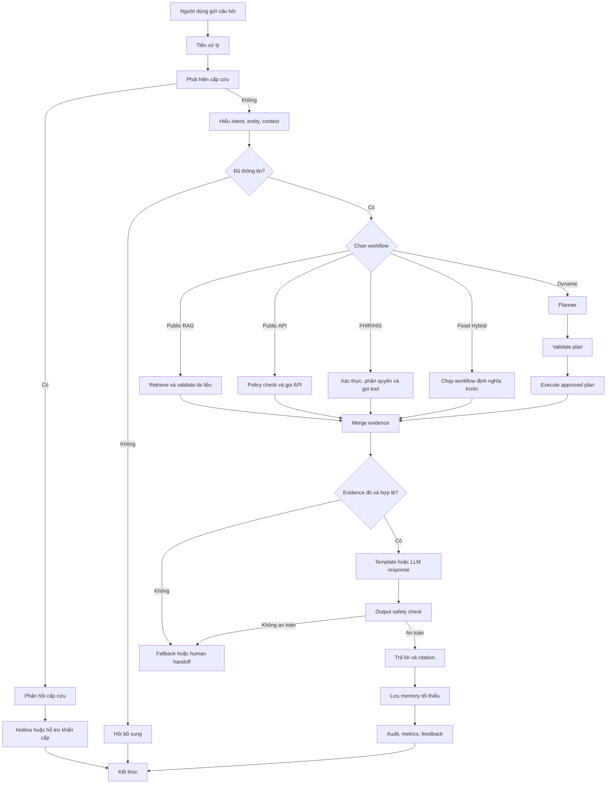

# YÊU CẦU NGHIỆP VỤ CHATBOT AI CHĂM SÓC KHÁCH HÀNG  
## Bệnh viện Tim Hà Nội

**Tên sản phẩm:** Intelligent AI Customer Care Assistant for Hanoi Heart Hospital  
**Phạm vi tài liệu:** Chỉ mô tả yêu cầu nghiệp vụ của chatbot, không bao gồm yêu cầu của toàn bộ website, cổng quản trị hay hệ thống thông tin bệnh viện.  
**Phiên bản:** 1.0  
**Trạng thái:** Bản đề xuất  

---

# 1. Mục đích tài liệu

Tài liệu này mô tả yêu cầu nghiệp vụ cho chatbot AI chăm sóc khách hàng của Bệnh viện Tim Hà Nội.

Chatbot có nhiệm vụ hỗ trợ bệnh nhân và người nhà:

- Tra cứu thông tin chính thức của bệnh viện.
- Tìm hiểu quy trình khám chữa bệnh.
- Tra cứu lịch bác sĩ, dịch vụ và giá khám khi có dữ liệu.
- Hỗ trợ đặt lịch hoặc chuyển hướng đến kênh đặt lịch chính thức.
- Tra cứu một số thông tin cá nhân sau khi xác thực.
- Phát hiện tình huống có dấu hiệu cấp cứu và phản hồi theo quy trình an toàn.
- Chuyển tiếp người dùng tới nhân viên chăm sóc khách hàng khi chatbot không thể xử lý.

Chatbot không được thay thế bác sĩ, không thực hiện chẩn đoán và không đưa ra quyết định điều trị.

---

# 2. Bối cảnh nghiệp vụ

Bệnh viện Tim Hà Nội tiếp nhận số lượng lớn bệnh nhân ngoại trú mỗi ngày. Bệnh nhân và người nhà thường xuyên cần hỗ trợ về:

- Đặt lịch khám.
- Lịch làm việc của bác sĩ.
- Chuyên khoa và khoa phòng.
- Quy trình khám chữa bệnh.
- Chính sách bảo hiểm y tế.
- Giá dịch vụ.
- Thủ tục nhập viện.
- Hướng dẫn tái khám.
- Giấy tờ cần chuẩn bị.
- Địa chỉ, hotline và giờ làm việc.
- Trạng thái lịch hẹn hoặc kết quả khám.
- Thông tin về thuốc, xét nghiệm và hồ sơ khám đối với người dùng đã xác thực.

Phần lớn các câu hỏi hiện được xử lý qua hotline, website, mạng xã hội và nhân viên tiếp đón. Việc triển khai chatbot nhằm giảm tải câu hỏi lặp lại, tăng khả năng hỗ trợ ngoài giờ và chuẩn hóa câu trả lời theo nguồn thông tin chính thức.

---

# 3. Mục tiêu nghiệp vụ

## 3.1. Mục tiêu chính

Chatbot phải:

1. Trả lời chính xác các câu hỏi phổ biến của bệnh nhân và người nhà.
2. Chỉ sử dụng thông tin từ nguồn chính thức đã được phê duyệt.
3. Không bịa đặt khi không tìm thấy thông tin.
4. Phân biệt dữ liệu tài liệu, dữ liệu động và dữ liệu cá nhân.
5. Hỗ trợ hội thoại nhiều lượt và hiểu ngữ cảnh.
6. Phát hiện sớm các dấu hiệu có thể liên quan đến cấp cứu.
7. Không đưa ra chẩn đoán, kê đơn hoặc hướng dẫn điều trị.
8. Kiểm soát quyền truy cập trước khi gọi công cụ hoặc truy xuất dữ liệu cá nhân.
9. Hỗ trợ chuyển tiếp sang nhân viên chăm sóc khách hàng.
10. Ghi nhận các thông tin cần thiết phục vụ giám sát và cải tiến chất lượng.

## 3.2. Mục tiêu mở rộng

Trong các giai đoạn sau, chatbot có thể hỗ trợ:

- Tra cứu lịch hẹn cá nhân.
- Tra cứu lịch tái khám.
- Tra cứu đơn thuốc đã được bác sĩ kê.
- Tra cứu kết quả xét nghiệm đã được công bố.
- Giải thích tên xét nghiệm hoặc thuật ngữ y tế ở mức thông tin.
- Nhắc lịch khám hoặc tái khám.
- Hỗ trợ giọng nói tiếng Việt.
- Hỗ trợ nhiều kênh như website, Zalo Mini App và ứng dụng di động.

---

# 4. Phạm vi chatbot

## 4.1. Trong phạm vi

Chatbot bao gồm các nhóm chức năng:

- Hội thoại bằng văn bản.
- Nhận dạng ý định người dùng.
- Trích xuất thông tin cần thiết từ câu hỏi.
- Quản lý ngữ cảnh hội thoại.
- Hỏi lại khi thiếu dữ kiện.
- Tra cứu kho tri thức chính thức bằng RAG.
- Gọi API công khai của bệnh viện.
- Gọi FHIR/HIS đối với dữ liệu cá nhân khi người dùng có quyền.
- Kiểm tra quyền gọi tool.
- Kiểm tra tính hợp lệ của dữ liệu trước khi trả lời.
- Sinh phản hồi có căn cứ.
- Hiển thị nguồn tham khảo.
- Phát hiện cấp cứu.
- Fallback khi không đủ thông tin.
- Chuyển tiếp nhân viên.
- Thu thập đánh giá câu trả lời.
- Ghi log và chỉ số vận hành của chatbot.
- Hỗ trợ ASR/TTS trong giai đoạn mở rộng.

## 4.2. Ngoài phạm vi

Chatbot không thực hiện:

- Chẩn đoán bệnh.
- Kê đơn thuốc.
- Đề xuất thay đổi liều thuốc.
- Khuyên người bệnh ngừng hoặc đổi thuốc.
- Đưa ra phác đồ điều trị.
- Phân tích ảnh X-quang, CT, MRI hoặc siêu âm để kết luận bệnh.
- Đưa ra quyết định nhập viện hoặc xuất viện.
- Sửa bệnh án.
- Tự động ghi dữ liệu y khoa vào hồ sơ bệnh nhân.
- Truy cập hồ sơ của bệnh nhân khác khi không có quyền.
- Tự động hủy hoặc thay đổi lịch hẹn mà không có xác nhận rõ ràng.
- Thay thế nhân viên y tế hoặc bác sĩ.
- Trả lời bằng kiến thức chung của mô hình khi không có căn cứ chính thức.

---

# 5. Đối tượng sử dụng

## 5.1. Người dùng chưa đăng nhập

Người dùng chưa đăng nhập được phép:

- Tra cứu thông tin bệnh viện.
- Tra cứu khoa, phòng và chuyên khoa.
- Tra cứu thông tin bác sĩ công khai.
- Tra cứu lịch bác sĩ công khai.
- Tra cứu giá dịch vụ công khai.
- Tra cứu quy trình khám.
- Tra cứu chính sách BHYT chung.
- Xem hướng dẫn đặt lịch.
- Nhận liên kết đến website, Zalo hoặc hotline.
- Sử dụng chức năng phát hiện cấp cứu.
- Yêu cầu kết nối nhân viên chăm sóc khách hàng.

Người dùng chưa đăng nhập không được phép:

- Xem lịch hẹn cá nhân.
- Xem kết quả xét nghiệm.
- Xem đơn thuốc.
- Xem hồ sơ bệnh án.
- Truy xuất bất kỳ dữ liệu sức khỏe cá nhân nào.

## 5.2. Bệnh nhân đã xác thực

Ngoài các quyền công khai, bệnh nhân đã xác thực có thể được phép:

- Xem lịch hẹn của chính mình.
- Xem lịch tái khám.
- Xem trạng thái xác nhận lịch hẹn.
- Xem đơn thuốc đã được kê.
- Xem kết quả xét nghiệm đã được công bố.
- Xem thông tin khám chữa bệnh thuộc phạm vi bệnh viện cho phép.
- Nhận hướng dẫn chuẩn bị cho lịch khám của chính mình.

Quyền cụ thể phụ thuộc vào hệ thống bệnh viện, trạng thái xác thực và sự đồng ý của người dùng.

## 5.3. Nhân viên bệnh viện

Trong trường hợp chatbot có chế độ dành cho nhân viên, quyền truy cập phải được kiểm soát theo vai trò và phạm vi công việc.

Chatbot không được mặc định cho phép nhân viên xem toàn bộ hồ sơ bệnh nhân.

---

# 6. Nguồn dữ liệu nghiệp vụ

## 6.1. Kho tri thức chính thức

Dùng cho các thông tin dạng tài liệu:

- Giới thiệu bệnh viện.
- Địa chỉ và thông tin liên hệ.
- Giờ làm việc.
- Quy trình khám chữa bệnh.
- Hướng dẫn đặt lịch.
- Hướng dẫn nhập viện và xuất viện.
- Hướng dẫn tái khám.
- Hướng dẫn BHYT.
- Mô tả khoa, phòng và chuyên khoa.
- Mô tả dịch vụ.
- Giấy tờ cần chuẩn bị.
- Thông báo chính thức.
- Nội dung giáo dục sức khỏe đã được phê duyệt.
- Câu hỏi thường gặp.

Các nội dung này được truy xuất bằng RAG.

## 6.2. Dữ liệu động công khai

Dùng cho:

- Lịch làm việc của bác sĩ.
- Trạng thái bác sĩ nghỉ hoặc thay lịch.
- Slot khám còn trống.
- Giá dịch vụ đang áp dụng.
- Trạng thái hoạt động của dịch vụ.
- Thông tin đặt lịch trực tuyến.

Các dữ liệu này phải được lấy từ API hoặc nguồn dữ liệu có cấu trúc khi có thể.

## 6.3. Dữ liệu cá nhân

Dùng cho:

- Lịch hẹn của bệnh nhân.
- Lịch tái khám.
- Kết quả xét nghiệm.
- Đơn thuốc.
- Hồ sơ khám.
- Chẩn đoán đã được bác sĩ ghi nhận.
- Các dữ liệu y tế khác được bệnh viện cho phép truy cập.

Dữ liệu cá nhân chỉ được truy xuất sau khi:

1. Người dùng đã xác thực.
2. Hệ thống xác định đúng danh tính.
3. Người dùng có quyền truy cập.
4. Dữ liệu thuộc đúng bệnh nhân.
5. Mục đích truy cập hợp lệ.
6. Việc truy cập được ghi audit log.

---

# 7. Danh mục ý định nghiệp vụ

Chatbot phải nhận diện tối thiểu các intent sau:

| Mã intent | Ý nghĩa |
|---|---|
| GREETING | Chào hỏi |
| HOSPITAL_INFORMATION | Thông tin chung về bệnh viện |
| HOSPITAL_CONTACT | Địa chỉ, hotline, liên hệ |
| WORKING_HOURS | Giờ làm việc |
| DEPARTMENT_INFORMATION | Thông tin khoa, phòng |
| DOCTOR_INFORMATION | Thông tin bác sĩ |
| DOCTOR_SCHEDULE | Lịch bác sĩ |
| APPOINTMENT_GUIDANCE | Hướng dẫn đặt lịch |
| APPOINTMENT_BOOKING | Yêu cầu đặt lịch |
| APPOINTMENT_STATUS | Trạng thái lịch hẹn |
| SERVICE_INFORMATION | Thông tin dịch vụ |
| SERVICE_PRICE | Giá dịch vụ |
| BHYT_INFORMATION | Chính sách BHYT |
| EXAMINATION_PROCEDURE | Quy trình khám |
| ADMISSION_PROCEDURE | Quy trình nhập viện |
| DISCHARGE_PROCEDURE | Quy trình xuất viện |
| FOLLOW_UP_GUIDANCE | Hướng dẫn tái khám |
| PATIENT_APPOINTMENT | Lịch hẹn cá nhân |
| PATIENT_RECORD | Hồ sơ bệnh nhân |
| LAB_RESULT | Kết quả xét nghiệm |
| MEDICATION_INFORMATION | Thông tin đơn thuốc đã kê |
| MEDICAL_EDUCATION | Kiến thức sức khỏe được phê duyệt |
| SYMPTOM_QUESTION | Người dùng hỏi về triệu chứng |
| EMERGENCY | Dấu hiệu có thể cấp cứu |
| COMPLAINT | Khiếu nại hoặc phản ánh |
| HUMAN_SUPPORT | Yêu cầu gặp nhân viên |
| OUT_OF_SCOPE | Ngoài phạm vi chatbot |

Một câu hỏi có thể chứa nhiều intent.

---

# 8. Yêu cầu chức năng

# BR-01. Tiếp nhận câu hỏi

Chatbot phải tiếp nhận câu hỏi bằng tiếng Việt dưới dạng văn bản.

Trong giai đoạn mở rộng, chatbot có thể tiếp nhận giọng nói thông qua ASR.

Chatbot phải:

- Kiểm tra câu hỏi rỗng.
- Giới hạn độ dài đầu vào.
- Chuẩn hóa ký tự và khoảng trắng.
- Xử lý lỗi gõ phổ biến.
- Xác định ngôn ngữ.
- Loại bỏ nội dung HTML hoặc script không hợp lệ.
- Không thực thi câu lệnh nằm trong nội dung người dùng.

---

# BR-02. Hiểu yêu cầu người dùng

Chatbot phải xác định:

- Intent.
- Các entity liên quan.
- Loại dữ liệu cần truy xuất.
- Yêu cầu có cần xác thực hay không.
- Yêu cầu có phải nhiều bước hay không.
- Yêu cầu có dấu hiệu cấp cứu hay không.

Các entity có thể gồm:

- Tên bác sĩ.
- Khoa.
- Chuyên khoa.
- Cơ sở bệnh viện.
- Ngày.
- Khung giờ.
- Tên dịch vụ.
- Mã lịch hẹn.
- Loại BHYT.
- Triệu chứng.
- Thuốc.
- Xét nghiệm.

---

# BR-03. Hiểu ngữ cảnh hội thoại

Chatbot phải hỗ trợ hội thoại nhiều lượt.

Ví dụ:

> Người dùng: Bác sĩ Nguyễn Văn A thuộc khoa nào?  
> Chatbot: Bác sĩ thuộc khoa Tim mạch can thiệp.  
> Người dùng: Thứ Hai bác sĩ có khám không?

Chatbot phải hiểu “bác sĩ” ở câu sau là bác sĩ vừa được nhắc đến.

Chatbot có thể lưu tạm:

- Bác sĩ đang được hỏi.
- Khoa đang được hỏi.
- Dịch vụ đang được hỏi.
- Cơ sở đang được hỏi.
- Lịch hẹn đang được hỏi.
- Intent gần nhất.

Chatbot không được lưu toàn bộ hồ sơ bệnh nhân vào memory hội thoại.

---

# BR-04. Hỏi bổ sung thông tin

Khi thiếu dữ kiện để xử lý, chatbot phải hỏi lại.

Ví dụ:

- Có nhiều bác sĩ trùng tên.
- Người dùng chưa cung cấp ngày khám.
- Người dùng chưa chọn cơ sở.
- Có nhiều dịch vụ có tên gần giống.
- Câu hỏi không xác định được bệnh nhân hoặc lịch hẹn.

Câu hỏi bổ sung phải:

- Ngắn gọn.
- Chỉ hỏi thông tin cần thiết.
- Không yêu cầu dữ liệu nhạy cảm khi chưa cần.
- Không hỏi lại thông tin người dùng đã cung cấp.

---

# BR-05. Tra cứu bằng RAG

Chatbot phải sử dụng RAG đối với các câu hỏi liên quan đến tài liệu chính thức.

Quy trình tối thiểu:

1. Chuẩn hóa câu hỏi.
2. Tìm kiếm theo ngữ nghĩa.
3. Tìm kiếm theo từ khóa.
4. Lọc theo metadata.
5. Rerank kết quả.
6. Kiểm tra nguồn.
7. Kiểm tra ngày hiệu lực.
8. Chọn evidence phù hợp.
9. Sinh câu trả lời chỉ từ evidence hợp lệ.

Chatbot không được sử dụng tài liệu:

- Chưa được phê duyệt.
- Đã hết hiệu lực.
- Bị đánh dấu deprecated.
- Không thuộc nguồn chính thức.
- Có nội dung mâu thuẫn chưa được xử lý.

---

# BR-06. Tra cứu dữ liệu động công khai

Chatbot phải gọi API hoặc tool công khai cho các câu hỏi như:

- Lịch bác sĩ.
- Giá dịch vụ.
- Slot khám.
- Trạng thái dịch vụ.
- Link đặt lịch.
- Thông tin khoa, phòng có cấu trúc.

Trước khi gọi tool, chatbot phải kiểm tra:

- Tool nằm trong allowlist.
- Tool được phép dùng cho người chưa đăng nhập.
- Tham số đúng schema.
- Ngày tháng hợp lệ.
- Không có tham số nguy hiểm.
- Số lần gọi tool không vượt giới hạn.

---

# BR-07. Truy xuất FHIR/HIS

Khi người dùng yêu cầu dữ liệu cá nhân, chatbot phải:

1. Kiểm tra trạng thái đăng nhập.
2. Kiểm tra quyền truy cập.
3. Lấy patient ID từ identity mapping hoặc token.
4. Không tin patient ID do người dùng hoặc LLM tự cung cấp.
5. Chọn đúng FHIR/HIS tool.
6. Gọi tool qua backend hoặc adapter.
7. Kiểm tra kết quả thuộc đúng bệnh nhân.
8. Ghi audit log.
9. Chỉ trả về trường dữ liệu cần thiết.

Các resource có thể hỗ trợ:

- Patient.
- Appointment.
- Encounter.
- Observation.
- DiagnosticReport.
- Condition.
- MedicationRequest.
- ServiceRequest.
- Practitioner.
- PractitionerRole.
- Location.
- Organization.

---

# BR-08. Định tuyến workflow

Chatbot phải định tuyến yêu cầu theo ít nhất các nhánh sau:

## Public RAG

Dùng khi câu hỏi chỉ cần tài liệu chính thức.

## Public Tool

Dùng khi câu hỏi cần dữ liệu động công khai.

## Authenticated FHIR/HIS

Dùng khi câu hỏi yêu cầu dữ liệu cá nhân.

## Fixed Hybrid Workflow

Dùng khi nghiệp vụ đã biết rõ cần kết hợp RAG và API.

Ví dụ:

- Lịch bác sĩ và giấy tờ cần mang.
- Giá dịch vụ và chính sách BHYT.
- Lịch khám và hướng dẫn chuẩn bị.

## Dynamic Multi-step Planner

Chỉ dùng với câu hỏi phức tạp, nhiều bước và không thể xử lý bằng workflow cố định.

Planner không phải bước bắt buộc cho mọi câu hỏi.

---

# BR-09. Lập kế hoạch nhiều bước

Khi cần planner, chatbot phải tạo kế hoạch có cấu trúc.

Mỗi bước cần có:

- Tên tool.
- Mục đích.
- Tham số.
- Dependency.
- Loại thao tác đọc hoặc ghi.
- Capability cần thiết.

Planner không được:

- Tự tạo tên tool mới.
- Tự tạo endpoint.
- Tự viết câu truy vấn SQL.
- Tự mở rộng quyền truy cập.
- Tự dùng patient ID từ nội dung hội thoại.
- Gọi tool không nằm trong allowlist.
- Tạo vòng lặp không giới hạn.

---

# BR-10. Kiểm tra kế hoạch

Mọi plan động phải được kiểm tra trước khi thực thi.

Việc kiểm tra phải bằng code, schema và rule, không phụ thuộc hoàn toàn vào LLM.

Các kiểm tra bắt buộc:

- Đúng JSON schema.
- Số bước không vượt giới hạn.
- Tool tồn tại.
- Tool nằm trong allowlist.
- Người dùng có capability cần thiết.
- Tham số đúng kiểu.
- Khoảng thời gian hợp lệ.
- Không có dependency vòng tròn.
- Không truy cập sai bệnh nhân.
- Không có thao tác ghi trái phép.
- Không gọi tool ngoài phạm vi nghiệp vụ.

Nếu plan không hợp lệ, chatbot phải:

- Từ chối thực thi.
- Chuyển sang workflow an toàn hơn.
- Hoặc fallback.

---

# BR-11. Thực thi tool

Chatbot phải thực thi tool theo approved plan.

Yêu cầu:

- Có timeout.
- Có giới hạn retry.
- Có giới hạn tổng số tool call.
- Có circuit breaker khi hệ thống ngoài lỗi.
- Ghi nhận lỗi.
- Không lặp vô hạn.
- Không thực thi bước chưa được duyệt.
- Không truyền toàn bộ nội dung hội thoại cho API khi không cần.

---

# BR-12. Kiểm tra kết quả tool

Sau khi nhận dữ liệu từ RAG, API hoặc FHIR, chatbot phải kiểm tra:

- Kết quả có thành công hay không.
- Có dữ liệu hay không.
- Timestamp.
- Ngày hiệu lực.
- Nguồn dữ liệu.
- Đúng cơ sở.
- Đúng bác sĩ.
- Đúng dịch vụ.
- Đúng bệnh nhân.
- Có mâu thuẫn với nguồn khác hay không.
- Có đủ dữ kiện để trả lời hay không.

Nếu API động mâu thuẫn với tài liệu tĩnh, chatbot phải ưu tiên dữ liệu động còn hiệu lực.

---

# BR-13. Sinh câu trả lời

Chatbot phải chọn một trong hai cách:

## Template response

Dùng với dữ liệu đơn giản, có cấu trúc:

- Ngày giờ khám.
- Lịch bác sĩ.
- Giá dịch vụ.
- Trạng thái lịch hẹn.
- Địa chỉ.
- Hotline.

Template giúp giảm số lần gọi LLM và hạn chế sai lệch.

## LLM response

Dùng khi cần:

- Tóm tắt nhiều nguồn.
- Diễn đạt tự nhiên.
- Kết hợp RAG và API.
- Trả lời câu hỏi nhiều ý.
- Giải thích quy trình.

LLM chỉ được sử dụng evidence đã được phê duyệt.

---

# BR-14. Grounded response

Mọi câu trả lời chứa thông tin nghiệp vụ phải có căn cứ.

Chatbot phải:

- Không thêm dữ kiện không có trong evidence.
- Không suy đoán.
- Không hợp thức hóa câu trả lời bằng nguồn không liên quan.
- Không dùng kiến thức nội tại của mô hình để thay thế nguồn bệnh viện.
- Nêu rõ khi thông tin chỉ mang tính tham khảo.
- Hiển thị nguồn khi phù hợp.
- Hiển thị thời gian cập nhật với dữ liệu động.

---

# BR-15. Trích dẫn nguồn

Câu trả lời dựa trên RAG phải có:

- Tên tài liệu hoặc trang.
- Nguồn chính thức.
- Ngày cập nhật hoặc kiểm tra nếu có.
- Phần nội dung liên quan khi giao diện hỗ trợ.

Câu trả lời từ API phải có:

- Tên hệ thống hoặc loại nguồn.
- Thời gian cập nhật.
- Cảnh báo lịch hoặc giá có thể thay đổi nếu nghiệp vụ yêu cầu.

---

# BR-16. Xử lý cấp cứu

Chatbot phải phát hiện sớm nội dung có dấu hiệu cấp cứu.

Ví dụ:

- Đau ngực dữ dội.
- Khó thở.
- Bất tỉnh.
- Ngất.
- Tím tái.
- Co giật.
- Chảy máu nghiêm trọng.
- Tim đập bất thường kèm choáng.
- Đau ngực lan lên tay, vai hoặc hàm.

Emergency detection phải kết hợp:

- Rule-based.
- Keyword.
- Classifier.
- LLM fallback khi cần.

Khi phát hiện nguy cơ cấp cứu, chatbot phải:

- Dừng luồng hỏi đáp thông thường.
- Không dùng RAG để giải thích bệnh.
- Không chẩn đoán.
- Không kê thuốc.
- Không hướng dẫn tự điều trị.
- Hướng dẫn gọi 115 hoặc đến cơ sở cấp cứu gần nhất.
- Hiển thị hotline hoặc kênh hỗ trợ theo quy trình chính thức.
- Ghi audit log.
- Cho phép chuyển nhân viên nếu có.

Chatbot phải xử lý đúng câu phủ định và ngữ cảnh.

Ví dụ:

- “Tôi không đau ngực.”
- “Bố tôi đang bất tỉnh.”
- “Hôm qua tôi đau ngực nhưng giờ đã hết.”

---

# BR-17. Câu hỏi triệu chứng

Khi người dùng hỏi về triệu chứng nhưng chưa có dấu hiệu cấp cứu rõ ràng, chatbot có thể:

- Cung cấp thông tin giáo dục sức khỏe đã được phê duyệt.
- Khuyến nghị người dùng đi khám.
- Hướng dẫn chọn chuyên khoa.
- Đề nghị liên hệ bác sĩ hoặc hotline.

Chatbot không được:

- Khẳng định người dùng mắc bệnh.
- Loại trừ bệnh.
- Đưa ra xác suất mắc bệnh.
- Chỉ định thuốc.
- Đưa ra phác đồ.

---

# BR-18. Thông tin thuốc

Chatbot có thể:

- Hiển thị thuốc đã được bác sĩ kê.
- Hiển thị liều dùng và hướng dẫn có trong đơn.
- Giải thích tên thuốc theo nguồn được phê duyệt.
- Nhắc người dùng tuân thủ đơn thuốc.

Chatbot không được:

- Tự thêm thuốc.
- Tự thay đổi liều.
- Khuyên ngừng thuốc.
- Khuyên thay thuốc.
- Đưa ra tương tác thuốc nếu không có nguồn được phê duyệt.
- Trả lời thay cho bác sĩ về thay đổi điều trị.

---

# BR-19. Kết quả xét nghiệm

Chatbot có thể:

- Hiển thị kết quả đã được bệnh viện công bố.
- Hiển thị đơn vị đo.
- Hiển thị khoảng tham chiếu do hệ thống trả về.
- Giải thích tên xét nghiệm ở mức thông tin.
- Khuyên người dùng trao đổi với bác sĩ khi có cờ bất thường.

Chatbot không được:

- Tự kết luận chẩn đoán từ kết quả.
- Tự xác định mức độ bệnh.
- Tự đề xuất điều trị.
- Tự gộp nhiều chỉ số để suy luận bệnh nếu chưa có quy trình được phê duyệt.

---

# BR-20. Đặt lịch khám

Khi chưa có API đặt lịch, chatbot phải:

- Thu thập nhu cầu khám.
- Xác định chuyên khoa.
- Xác định cơ sở.
- Hướng dẫn người dùng đặt lịch.
- Cung cấp link website, Zalo hoặc hotline.
- Không tuyên bố đặt lịch thành công.

Khi có API đặt lịch, chatbot có thể:

1. Tìm slot.
2. Hiển thị lựa chọn.
3. Thu thập thông tin cần thiết.
4. Xác thực người dùng.
5. Hiển thị toàn bộ thông tin.
6. Yêu cầu người dùng xác nhận.
7. Gọi API.
8. Hiển thị mã lịch hẹn.
9. Ghi audit log.

---

# BR-21. Thao tác ghi dữ liệu

Các thao tác như:

- Tạo lịch hẹn.
- Hủy lịch.
- Đổi lịch.
- Cập nhật thông tin liên hệ.

Phải có:

- Xác thực.
- Kiểm tra quyền.
- Xác nhận rõ ràng.
- Idempotency key.
- Ghi audit log.
- Thông báo kết quả thành công hoặc thất bại.

Chatbot không được suy diễn một câu nói mơ hồ thành lệnh ghi dữ liệu.

Ví dụ:

> “Có lẽ tôi không đi khám được.”

Câu này không đủ để hủy lịch.

---

# BR-22. Fallback

Chatbot phải fallback khi:

- Không tìm thấy nguồn.
- Nguồn hết hiệu lực.
- Nguồn mâu thuẫn.
- API lỗi.
- Không có quyền truy cập.
- Chưa xác thực.
- Thiếu dữ kiện.
- Câu hỏi ngoài phạm vi.
- Câu hỏi cần bác sĩ hoặc nhân viên xử lý.
- Độ tin cậy không đạt ngưỡng.

Phản hồi fallback phải:

- Thừa nhận không đủ thông tin.
- Không suy đoán.
- Nêu rõ bước tiếp theo.
- Cung cấp hotline, website hoặc kênh hỗ trợ phù hợp.
- Không sử dụng câu trả lời chung chung gây hiểu nhầm.

---

# BR-23. Chuyển tiếp nhân viên

Chatbot phải hỗ trợ human handoff trong các trường hợp:

- Người dùng yêu cầu.
- Khiếu nại.
- Vấn đề BHYT phức tạp.
- Không xác minh được danh tính.
- API lỗi kéo dài.
- Nguồn mâu thuẫn.
- Người dùng liên tục đánh giá câu trả lời sai.
- Yêu cầu vượt phạm vi chatbot.
- Tình huống y tế cần nhân viên hỗ trợ.

Gói chuyển tiếp nên gồm:

- Tóm tắt hội thoại.
- Intent.
- Câu hỏi cuối cùng.
- Dữ liệu đã thu thập.
- Nguồn đã tìm.
- Tool đã gọi.
- Lỗi.
- Mức độ khẩn cấp.
- Thông tin liên hệ nếu người dùng đồng ý.

Chatbot phải giảm việc người dùng phải trình bày lại.

---

# BR-24. Đánh giá phản hồi

Người dùng phải có thể:

- Đánh giá hữu ích.
- Đánh giá không hữu ích.
- Báo thông tin sai.
- Yêu cầu gặp nhân viên.

Feedback phải được liên kết với:

- Câu hỏi.
- Intent.
- Câu trả lời.
- Nguồn.
- Tool result.
- Phiên bản knowledge base.
- Phiên bản model.
- Thời gian xử lý.

Feedback không được tự động đưa vào knowledge base production nếu chưa có kiểm duyệt.

---

# BR-25. Memory

Chatbot phải hỗ trợ short-term memory theo phiên.

Được phép lưu:

- Intent gần nhất.
- ID bác sĩ đang được hỏi.
- ID khoa hoặc dịch vụ.
- Cơ sở.
- Lịch hẹn đang được hỏi.
- Trạng thái workflow.

Không nên lưu:

- Toàn bộ hồ sơ bệnh án.
- Toàn bộ kết quả xét nghiệm.
- Access token.
- Mật khẩu.
- CCCD dạng rõ.
- Dữ liệu y tế không cần thiết.

Memory phải hết hạn theo chính sách phiên.

---

# BR-26. Semantic cache

Chatbot có thể dùng semantic cache cho:

- FAQ.
- Quy trình ổn định.
- Thông tin khoa, phòng.
- Giờ làm việc.
- Nội dung công khai ít thay đổi.

Cache key nên bao gồm:

- Câu hỏi chuẩn hóa.
- Intent.
- Cơ sở.
- Ngôn ngữ.
- Loại người dùng.
- Phiên bản knowledge base.
- Ngày hiệu lực.

Không được dùng cache chung cho:

- Hồ sơ bệnh nhân.
- Kết quả xét nghiệm.
- Đơn thuốc.
- Lịch hẹn cá nhân.
- Dữ liệu y tế nhạy cảm.

---

# BR-27. Hỗ trợ giọng nói

Trong giai đoạn mở rộng, chatbot có thể hỗ trợ:

- ASR tiếng Việt.
- TTS tiếng Việt.

Yêu cầu:

- Hiển thị văn bản nhận dạng để người dùng kiểm tra.
- Xác nhận lại ngày, giờ, tên bác sĩ và thuốc.
- Chạy emergency detection trên văn bản ASR.
- Xử lý lỗi nhận dạng câu phủ định.
- Không chỉ dựa vào âm thanh để xác nhận thao tác ghi dữ liệu.

---

# BR-28. Bảo vệ dữ liệu cá nhân

Chatbot phải tuân thủ các nguyên tắc:

- Chỉ thu thập dữ liệu cần thiết.
- Xử lý đúng mục đích.
- Không đưa dữ liệu cá nhân vào prompt khi không cần.
- Mask dữ liệu nhạy cảm trong log.
- Không để người dùng truy cập dữ liệu của bệnh nhân khác.
- Không lưu token trong memory.
- Không hiển thị dữ liệu vượt quá phạm vi cần thiết.
- Ghi audit cho truy cập dữ liệu sức khỏe.
- Có cơ chế timeout phiên.
- Có khả năng xóa hoặc ẩn danh dữ liệu theo chính sách.

---

# BR-29. Chống prompt injection

Chatbot phải:

- Không thực hiện yêu cầu “bỏ qua hướng dẫn trước”.
- Không coi nội dung tài liệu RAG là system instruction.
- Không cho phép người dùng chọn tool trực tiếp.
- Không cho phép người dùng chỉ định endpoint.
- Không cho phép người dùng tự tăng quyền.
- Không cho LLM tạo raw SQL.
- Không cho LLM tạo raw FHIR query không kiểm soát.
- Lọc script, HTML ẩn và nội dung bất thường.
- Chỉ dùng nguồn nằm trong allowlist.

---

# BR-30. Kiểm tra an toàn đầu ra

Trước khi gửi câu trả lời, chatbot phải kiểm tra:

- Có nội dung chẩn đoán trái phép không.
- Có khuyến nghị điều trị không được phép không.
- Có dữ liệu cá nhân bị lộ không.
- Có thông tin không có bằng chứng không.
- Có mâu thuẫn với tool result không.
- Có citation không đúng không.
- Có chỉ dẫn cấp cứu chưa đúng quy trình không.

Nếu phản hồi không an toàn, chatbot phải thay bằng safe fallback.

---

# 9. Quy tắc nghiệp vụ quan trọng

## RULE-01. Ưu tiên nguồn

Thứ tự ưu tiên:

1. API động chính thức.
2. Dữ liệu HIS/FHIR đã xác thực.
3. Tài liệu chính thức còn hiệu lực.
4. Nguồn y tế bên ngoài đã được bệnh viện phê duyệt.

## RULE-02. Không bịa đặt

Không có nguồn hoặc tool result hợp lệ thì chatbot không được trả lời như một sự thật.

## RULE-03. Không dùng RAG cho mọi dữ liệu

Lịch bác sĩ, giá hiện hành, lịch hẹn và hồ sơ bệnh nhân phải ưu tiên dữ liệu có cấu trúc.

## RULE-04. Planner không bắt buộc

Câu hỏi đơn giản phải đi theo fixed workflow để giảm chi phí và độ trễ.

## RULE-05. Rule engine có quyền quyết định cuối cùng

LLM không được ghi đè:

- Authentication.
- Authorization.
- Tool allowlist.
- Patient ownership.
- Read/write permission.
- Confirmation requirement.
- Emergency rules.

## RULE-06. Patient ID

Patient ID phải lấy từ token hoặc identity mapping, không lấy trực tiếp từ câu người dùng để truy cập dữ liệu.

## RULE-07. Thao tác ghi

Mọi thao tác ghi phải có xác nhận rõ ràng.

## RULE-08. Dữ liệu mâu thuẫn

Nếu API động và tài liệu tĩnh mâu thuẫn, ưu tiên API động còn hiệu lực và ghi nhận mâu thuẫn.

## RULE-09. Cấp cứu

Nhánh cấp cứu phải được ưu tiên trước RAG, planner và tool thông thường.

## RULE-10. Dữ liệu nhạy cảm

Dữ liệu nhạy cảm không được cache dùng chung và không được lưu vào long-term memory nếu không có mục đích hợp lệ.

---

# 10. Yêu cầu phi chức năng của chatbot

## 10.1. Hiệu năng

Mục tiêu đề xuất:

- Câu hỏi FAQ đơn giản: phản hồi p95 dưới 5 giây.
- Câu hỏi gọi một API: phản hồi p95 dưới 7 giây.
- Câu hỏi nhiều bước: phản hồi p95 dưới 12 giây.
- Emergency response phải được ưu tiên và phản hồi nhanh nhất có thể.
- Không gọi planner cho câu hỏi đơn giản.
- Không gọi LLM lặp lại không cần thiết.

## 10.2. Khả dụng

- Có fallback khi LLM hoặc API lỗi.
- Có retry có giới hạn.
- Không retry vô hạn.
- Có circuit breaker.
- Có thông báo rõ khi dịch vụ tạm thời không hoạt động.

## 10.3. Khả năng mở rộng

Chatbot phải hỗ trợ bổ sung:

- Intent mới.
- Tool mới.
- Nguồn RAG mới.
- Kênh giao tiếp mới.
- Model mới.
- Rule an toàn mới.

Mà không phải thay đổi toàn bộ workflow.

## 10.4. Quan sát hệ thống

Cần theo dõi:

- Số request.
- Intent.
- Tỷ lệ RAG thành công.
- Tool error.
- Fallback rate.
- Human handoff rate.
- Latency p50, p95, p99.
- Token usage.
- Cost.
- Cache hit.
- Emergency detection.
- Safety violation.
- Feedback.

## 10.5. Audit

Audit log tối thiểu gồm:

- Thời gian.
- Session ID.
- User ID đã mask hoặc pseudonym.
- Intent.
- Route.
- Tool.
- Capability.
- Kết quả kiểm tra quyền.
- Trạng thái thực thi.
- Loại dữ liệu đã truy cập.
- Mã lỗi.
- Trạng thái phản hồi.

Không ghi trực tiếp toàn bộ dữ liệu y tế vào audit log.

---

# 11. Yêu cầu về sử dụng LLM

LLM có thể được dùng cho:

- Nhận diện intent.
- Trích xuất entity phức tạp.
- Hiểu ngữ cảnh.
- Query rewrite.
- Lập kế hoạch nhiều bước.
- Tổng hợp evidence.
- Diễn đạt câu trả lời.
- Safety check bổ sung.

LLM không được dùng làm lớp quyết định cuối cùng cho:

- Xác thực.
- Phân quyền.
- Patient ownership.
- Tool allowlist.
- Schema validation.
- Thao tác ghi.
- Audit.
- Emergency rule bắt buộc.

Không phải mỗi node LangGraph đều gọi LLM.

---

# 12. Luồng nghiệp vụ tổng quát

---

# 13. Các luồng nghiệp vụ mẫu

## 13.1. Tra cứu quy trình BHYT

**Câu hỏi:** “Khám BHYT cần mang giấy tờ gì?”

Luồng:

1. Xác định intent BHYT.
2. Không cần xác thực.
3. Đi vào Public RAG.
4. Retrieve tài liệu BHYT.
5. Kiểm tra ngày hiệu lực.
6. Sinh câu trả lời.
7. Gắn nguồn.
8. Trả về người dùng.

## 13.2. Tra cứu lịch bác sĩ

**Câu hỏi:** “Ngày mai bác sĩ A có khám không?”

Luồng:

1. Xác định intent DOCTOR_SCHEDULE.
2. Trích xuất tên bác sĩ và ngày.
3. Gọi API lịch bác sĩ.
4. Kiểm tra timestamp.
5. Trả lời bằng template.
6. Hiển thị link đặt lịch.

## 13.3. Tra cứu lịch tái khám cá nhân

**Câu hỏi:** “Lịch tái khám tiếp theo của tôi là khi nào?”

Luồng:

1. Xác định intent PATIENT_APPOINTMENT.
2. Kiểm tra đăng nhập.
3. Kiểm tra quyền.
4. Lấy patient ID từ token.
5. Gọi FHIR/HIS.
6. Kiểm tra patient scope.
7. Trả lời.
8. Ghi audit.

## 13.4. Câu hỏi kết hợp

**Câu hỏi:** “Thứ Hai có bác sĩ tim mạch nào khám và tôi cần mang giấy tờ gì?”

Luồng:

1. Xác định hai intent.
2. Chạy song song:
   - API lịch bác sĩ.
   - RAG giấy tờ khám.
3. Hợp nhất evidence.
4. Kiểm tra dữ liệu.
5. Sinh câu trả lời tổng hợp.

## 13.5. Câu hỏi cấp cứu

**Câu hỏi:** “Tôi đau ngực dữ dội và khó thở.”

Luồng:

1. Emergency detector phát hiện nguy cơ.
2. Dừng workflow thông thường.
3. Không RAG.
4. Không planner.
5. Không chẩn đoán.
6. Hướng dẫn gọi 115 hoặc đến cấp cứu.
7. Hiển thị hotline.
8. Ghi audit.

---

# 14. Tiêu chí nghiệm thu

## AC-01. Grounded answer

- Mọi câu trả lời nghiệp vụ phải có evidence.
- Không trả lời khi evidence không đủ.
- Citation phải trỏ đúng nguồn.

## AC-02. Quyền truy cập

- Anonymous không truy cập được dữ liệu bệnh nhân.
- Patient chỉ truy cập được dữ liệu của chính mình.
- Patient ID phải lấy từ identity mapping.
- Mọi truy cập dữ liệu cá nhân phải có audit.

## AC-03. Tool security

- Tool ngoài allowlist không được thực thi.
- Plan sai schema không được thực thi.
- Tool ghi phải có xác nhận.
- Không có vòng lặp tool vô hạn.

## AC-04. Emergency

- Các tình huống cấp cứu trong bộ test phải được ưu tiên.
- Chatbot không được đưa ra điều trị.
- Phản hồi phải hướng người dùng đến hỗ trợ cấp cứu.
- Theo dõi FNR của emergency classifier.

## AC-05. RAG

- Không sử dụng tài liệu chưa duyệt.
- Không sử dụng tài liệu hết hiệu lực.
- Có hybrid retrieval.
- Có metadata filter.
- Có rerank.
- Có fallback khi retrieval không đủ.

## AC-06. FHIR/HIS

- Chỉ gọi khi người dùng có quyền.
- Kiểm tra đúng patient scope.
- Không trả trường dữ liệu thừa.
- Có xử lý API timeout hoặc lỗi.

## AC-07. Hiệu năng

- Không dùng planner với intent đơn giản.
- Có thể dùng template cho structured response.
- Có giới hạn tool call.
- Có timeout và retry hợp lý.

## AC-08. Hội thoại

- Hiểu được tham chiếu trong hội thoại.
- Không hỏi lại dữ liệu đã có.
- Hỏi bổ sung khi thiếu dữ kiện.
- Không làm mất intent đang xử lý.

## AC-09. Fallback

- Không bịa đặt khi không có dữ liệu.
- Đưa ra kênh hỗ trợ thay thế.
- Hỗ trợ human handoff khi cần.

## AC-10. Safety output

- Không chứa chẩn đoán.
- Không chứa kê đơn.
- Không làm lộ dữ liệu cá nhân.
- Không trái với evidence.
- Không chứa citation giả.

---

# 15. Chỉ số đánh giá chatbot

## 15.1. Chất lượng hiểu yêu cầu

- Intent accuracy.
- Entity extraction accuracy.
- Multi-intent accuracy.
- Context resolution accuracy.

## 15.2. Chất lượng RAG

- Recall@K.
- Precision@K.
- MRR.
- NDCG.
- Context relevance.
- Answer faithfulness.
- Citation correctness.
- Citation completeness.

## 15.3. Chất lượng nghiệp vụ

- Self-service resolution rate.
- Fallback rate.
- Human handoff rate.
- Appointment redirect rate.
- User satisfaction.
- Repeat-question rate.

## 15.4. An toàn

- Emergency recall.
- Emergency false negative rate.
- Medical advice violation rate.
- Unauthorized tool call rate.
- Cross-patient data leak rate.
- PII exposure rate.
- Prompt injection success rate.

## 15.5. Hiệu năng

- p50 latency.
- p95 latency.
- p99 latency.
- Token per request.
- Cost per request.
- Tool call per request.
- Cache hit rate.

---

# 16. Phạm vi MVP đề xuất

MVP nên bao gồm:

1. Chat tiếng Việt bằng văn bản.
2. Intent classification.
3. Entity extraction.
4. Context memory ngắn hạn.
5. Emergency detection.
6. Public RAG.
7. Citation.
8. Public doctor schedule API hoặc dữ liệu cấu trúc.
9. Public service price API hoặc dữ liệu cấu trúc.
10. Booking redirect.
11. Fallback.
12. Human handoff.
13. Feedback.
14. Audit và metrics cơ bản.
15. Rule-based tool permission.
16. Fixed workflow cho intent phổ biến.

Chưa cần đưa vào MVP:

- Dynamic planner cho mọi câu hỏi.
- Chẩn đoán.
- Tư vấn điều trị.
- Phân tích ảnh y tế.
- Ghi bệnh án.
- ASR/TTS.
- Tự động thay đổi lịch.
- Truy xuất toàn bộ FHIR resource.

---

# 17. Lộ trình mở rộng chatbot

## Giai đoạn 1 — Public Assistant

- FAQ RAG.
- Quy trình khám.
- BHYT.
- Khoa, bác sĩ.
- Giá.
- Lịch bác sĩ.
- Booking redirect.
- Emergency.
- Citation.
- Fallback.

## Giai đoạn 2 — Dynamic Integration

- Lịch bác sĩ real-time.
- Slot khám.
- Giá dịch vụ real-time.
- Trạng thái đặt lịch.
- Human handoff.
- Notification.

## Giai đoạn 3 — Patient Assistant

- Đăng nhập.
- Consent.
- Lịch hẹn.
- Tái khám.
- Đơn thuốc.
- Kết quả xét nghiệm.
- FHIR/HIS integration.
- Patient-specific audit.

## Giai đoạn 4 — Medical Information Extension

- Chuẩn hóa thuật ngữ.
- Giải thích xét nghiệm.
- Giải thích thuốc đã kê.
- Medical RAG được phê duyệt.
- Safety nâng cao.

## Giai đoạn 5 — Voice và đa kênh

- ASR.
- TTS.
- Zalo.
- Mobile app.
- Voicebot.
- Đồng bộ phiên hội thoại.

---

# 18. Kết luận

Chatbot của Bệnh viện Tim Hà Nội phải được thiết kế như một hệ thống điều phối hội thoại có kiểm soát, không phải một chatbot RAG đơn giản.

Nguyên tắc trọng tâm:

- RAG dùng cho tài liệu.
- API dùng cho dữ liệu động.
- FHIR/HIS dùng cho dữ liệu cá nhân.
- Rule engine kiểm soát quyền.
- Planner chỉ dùng cho yêu cầu phức tạp.
- Emergency được kiểm tra sớm.
- Mọi câu trả lời phải có căn cứ.
- Không đủ dữ liệu thì fallback.
- Không chẩn đoán và không điều trị.
