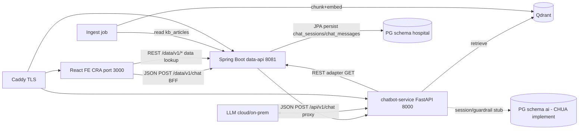

# 05 — System Architecture

> **Mục đích:** component diagram, data flow, deploy, ADR.
> **Đọc sau:** `01-project-overview` §6, `06-database-design`, `00-data-strategy`.
> Cập nhật: 2026-07-18 · Phiên bản: **v1.1** · Trạng thái: **Review** (owner: AI + Spring Boot).

---

## 1. Kiến trúc 3 lớp (3-tier, swappable)

> ⚠️ **Trạng thái thực tế (2026-07-18):**
> - **Web FE** thực tế = **React 18.2 + Create React App** (JSX, không TypeScript, port 3000, dir `frontend/`) — **KHÔNG phải Next.js 15**.
> - **Chat contract** thực tế = **plain JSON blocking** qua `POST /api/v1/chat` (chatbot-service, port 8000) — **KHÔNG có SSE, KHÔNG streaming, KHÔNG token events**.
> - **Chatbot memory** (`chatbot-service/memory/session_memory.py`) là **STUB no-op**, `session_id` opaque/chưa dùng — **KHÔNG persist** conversation ở lớp AI.
> - **Quyết định mới (Recommendation A / ADR-008, lead-approved):** **data-api làm chat BFF + persistence**. Flow thực tế đề xuất: FE → `data-api POST /data/v1/chat` (JSON) → data-api persist session+message (bảng mới `chat_sessions`/`chat_messages` trong schema `hospital`, Flyway) → proxy `chatbot-service POST /api/v1/chat` (JSON) → lưu assistant reply+citations → trả `{answer, citations, ...}` cho FE. Không streaming (YAGNI). `GET /data/v1/chat/sessions` + `GET /data/v1/chat/sessions/{id}/messages` để FE load lại lịch sử.
> - Sơ đồ và bảng dưới đây (Next.js / SSE / FastAPI-owns-chat) = **đề xuất gốc, chưa hiện thực**, giữ làm roadmap.

```
React FE ──JSON──▶ data-api (chat BFF+persist) ──JSON──▶ chatbot-service (FastAPI AI) ──REST──▶ Spring Boot data ──▶ PostgreSQL (hospital)
    │                       │                              │                                         │
    └──REST (data)──────────┘                              └─retrieve──▶ Qdrant (kb_chunks)            ▼
       (cũng /data/v1/*)                                       (session stub — KHÔNG persist)     schema hospital (chat_sessions/chat_messages mới)
```

| Lớp | Tech | Sở hữu | Vai trò |
|---|---|---|---|
| **Web FE** | React 18 + CRA (thực tế) · Next.js 15 (đề xuất) | 2 web | chat UI, data lookup, citation, ASR/TTS |
| **Chat BFF + Persistence** | Spring Boot (data-api, port 8081) | data dev | **ADR-008** persist chat session/message (schema `hospital`), proxy JSON → chatbot-service |
| **AI Gateway** | FastAPI (chatbot-service, port 8000) | 2 AI | chat JSON (không SSE thực tế), intent/emergency guardrail, RAG retrieve+rerank+LLM, ingest→Qdrant, eval |
| **Data Service** | Spring Boot + JPA | data dev | business data REST, PG `hospital`, seed loader |
| **DB** | PostgreSQL | shared | schema `hospital` (Spring Boot — incl. chat persistence ADR-008) + `ai` (FastAPI — chưa triển khai, memory stub) |
| **Vector** | Qdrant | AI | `kb_chunks` (BGE-M3) |

## 2. Component diagram



> ⚠️ Sơ đồ trên = **kiến trúc thực tế (2026-07-18) + Recommendation A (ADR-008)**: data-api làm chat BFF + persistence. Đường `FE ──SSE──▶ FastAPI` trong sơ đồ gốc (đề xuất ADR-005/006) là **proposed-not-built** — chưa có SSE, chưa wire FE↔chatbot trực tiếp.

## 3. Data flow — chat request

> ⚠️ **Thực tế (2026-07-18) + Recommendation A (ADR-008):** data flow mới, FE không gọi thẳng FastAPI.

1. **FE** `POST /data/v1/chat` (plain JSON: `{sessionId?, text, lang?}`) → **data-api** (port 8081).
2. **data-api (BFF)** persist user message vào `chat_messages` (schema `hospital`), tạo/s-dụng `chat_sessions`.
3. **data-api** proxy `POST /api/v1/chat` (JSON: `ChatRequest{sessionId, text, lang, userId, userRole, allowedPatientIds[], context{}}`) → **chatbot-service** (FastAPI, port 8000).
4. **Intent router** → phân loại (faq/booking/bhyt/pricing/emergency/oos).
5. **Emergency check** (rule+LLM, R2 kill switch) → dương: ngắt, trả cảnh báo + redirect 115/Cấp cứu (fail-safe).
6. **Retrieve** Qdrant top-k → **rerank** (BGE-reranker) → ngưỡng score? không → FR-7 refusal.
7. **LLM grounded** (system prompt cứng + chunks context + R4 no-advice) → answer + citations.
8. **chatbot-service** trả `ChatResponse{answer, citations[], confidence, guardrailFlags[], intent, route, redirection, needsHandoff, metadata}` (JSON blocking, không SSE).
9. **data-api** persist assistant reply + citations vào `chat_messages`; trả về FE gọn gàng cùng `sessionId`.
10. **Observability/logging** giờ ở schema `hospital` (qua data-api); schema `ai` hiện chưa triển khai (chatbot memory stub).

> Lịch sử: `GET /data/v1/chat/sessions` (list) + `GET /data/v1/chat/sessions/{id}/messages` (detail). Retention/TTL theo NFR-2 / R5 (≤24h, anonymous, deletable).

## 4. KB ingest flow
`data/raw/*.txt` → parse → Spring Boot `kb_articles`/`faqs`/`procedures` (PG `hospital`) → ingest job **chunk + embed (BGE-M3)** → upsert Qdrant `kb_chunks` (payload: source/url/category/tags/form_code). Re-embed khi `hash` đổi.

## 5. Adapter pattern (swappable — ô 03)
```
FastAPI → HospitalDataProvider (interface)
            ├─ DemoDataProvider ──REST──▶ Spring Boot /data/v1/* ──▶ PG
            └─ HisDataProvider  ──▶ Hospital HIS API (prod)
```
Env `DATA_PROVIDER=demo|his`. Interface ổn định → prod chỉ swap adapter + Docker.

## 6. Deployment (demo — 1 VPS, Docker Compose)
- Services: `web` (Next standalone) · `api` (FastAPI) · `data-api` (Spring Boot) · `postgres` · `qdrant` · `caddy`.
- Caddy auto-TLS, route: `/`→web, `/api/*`→api, `/data/*`→data-api.
- 1 lệnh `docker compose up -d`. Pilot: cùng image sang infra BV, LLM on-prem (Qwen2.5/Vistral), không data egress.

## 7. ADR (Architecture Decision Records)
| ID | Quyết định | Lý do |
|---|---|---|
| ADR-001 | RAG thuần, không fine-tune | Grounding nhanh, kiểm soát nguồn, 48h |
| ADR-002 | LLM cloud (demo) + on-prem path (pilot) | Chất lượng 48h + privacy HIS |
| ADR-003 | Qdrant (không pgvector) | Tối ưu vector + filter payload, production-ready |
| ADR-004 | Guardrail rule+LLM classifier, **fail-safe** emergency | Ô 05, không fail-open |
| ADR-005 | FE: Next.js (App Router) | Team React, BFF proxy, streaming, Docker |
| ADR-006 | 3-tier: Spring Boot data tách FastAPI AI | Swappable HIS (ô 03), ownership rõ |
| ADR-007 | 1 PG container, 2 schema (hospital+ai) | DRY infra, conversation thuộc AI |
| **ADR-008** | **data-api = chat BFF + persistence** (FE → `POST /data/v1/chat` → data-api persist + proxy chatbot `/api/v1/chat` JSON). Bảng `chat_sessions`/`chat_messages` ở schema `hospital`, Flyway `V10`. | Recommendation A (lead-approved 2026-07-18): YAGNI (không SSE), conversation persistence thuộc Spring Boot layer (đã có Flyway + JPA), chatbot-service giữ stateless RAG/guardrail. **Supersedes** phần "chat owned by FastAPI / session persistence in `ai` schema" của ADR-006/007. **Status: IMPLEMENTED (2026-07-18, commit `de120e2`)** — Flyway V10 applied PG, `ChatSession`/`ChatMessage` entity, `ChatService.handleMessage`, `ChatbotClient` (RestClient), `ChatController` 3 endpoints; 11/11 tests pass. Pending: real-chatbot E2E + merge `develop`. |

> ⚠️ **ADR-005 NOT followed (2026-07-18):** FE thực tế = React 18 + CRA (không Next.js). Lý do thay đổi: dev team đã chạy được CRA, không cần SSR/Route Handler BFF vì **data-api đã là BFF** (ADR-008). Next.js giữ roadmap nếu cần SSR/SEO.

> ⚠️ **Circular call data-api ↔ chatbot (2026-07-18, ADR-008 implemented):** khi xử lý chat, **data-api** gọi `chatbot POST /api/v1/chat` (JSON) để lấy answer + citations; **chatbot-service** ngược lại gọi `data-api GET /data/v1/*` (REST adapter) để lấy hospital data (doctors/prices/BHYT/...) làm context RAG. **Không deadlock** vì 2 hướng dùng endpoint khác nhau + chat call là blocking JSON hoàn thành mới trả, còn data lookup của chatbot xảyria **trước/song song** trong phase retrieve (không nắm giữ transaction data-api). Cần lưu ý khi timeout: data-api `read-timeout-ms` ≥ tổng thời gian chatbot (bao gồm retrieve + LLM). Để tránh stack đệ quy, **chatbot KHÔNG** được gọi ngược lại `POST /data/v1/chat`.

> ⚠️ **Fallback-on-upstream-error contract (2026-07-18):** khi chatbot-service down/timeout/5xx/parse-error → `ChatbotClient` ném `ChatbotUnavailableException` → `ChatService` **persist fallback assistant message** (answer = `"Tạm thời không kết nối được tới trợ lý. Vui lòng thử lại."`, `guardrailFlags=["upstream_error"]`, `intent="UNKNOWN"`) → trả **HTTP 200** (không 5xx) cho FE. User message vẫn được persist trước đó. Lý do 200: FE không cần branch error path riêng cho upstream-down; user có thể xem lại lịch sử tin nhắn và thử lại.

## 8. Liên quan
- [[01-project-overview]] · [[06-database-design]] · [[07-api-design]] · [[09-deployment-guide]] · [[00-data-strategy]]
