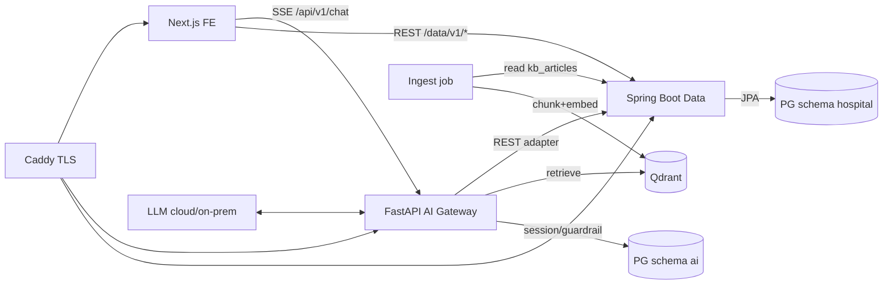

# 05 — System Architecture

> **Mục đích:** component diagram, data flow, deploy, ADR.
> **Đọc sau:** `01-project-overview` §6, `06-database-design`, `00-data-strategy`.
> Cập nhật: 2026-07-17 · Phiên bản: **v1.0** · Trạng thái: **Review** (owner: AI + Spring Boot).

---

## 1. Kiến trúc 3 lớp (3-tier, swappable)

```
Next.js FE ──SSE──▶ FastAPI (AI) ──REST──▶ Spring Boot (data) ──▶ PostgreSQL (hospital)
    │                    │                        │                    
    └──REST (data)──▶ Spring Boot ◀── ingest ─── FastAPI (chunk+embed) ──▶ Qdrant (kb_chunks)
                                              (session/guardrail) ──▶ PostgreSQL (ai schema)
```

| Lớp | Tech | Sở hữu | Vai trò |
|---|---|---|---|
| **Web FE** | Next.js 15 | 2 web | chat UI, data lookup, citation, ASR/TTS |
| **AI Gateway** | FastAPI | 2 AI | chat SSE, intent/emergency guardrail, RAG retrieve+rerank+LLM, ingest→Qdrant, eval |
| **Data Service** | Spring Boot + JPA | data dev | business data REST, PG `hospital`, seed loader |
| **DB** | PostgreSQL | shared | schema `hospital` (Spring Boot) + `ai` (FastAPI) |
| **Vector** | Qdrant | AI | `kb_chunks` (BGE-M3) |

## 2. Component diagram



## 3. Data flow — chat request
1. FE `POST /api/v1/chat` (SSE) → FastAPI.
2. **Intent router** → phân loại (faq/booking/bhyt/pricing/emergency/oos).
3. **Emergency check** (rule+LLM, R2 kill switch) → dương: ngắt, trả cảnh báo + redirect 115/Cấp cứu (fail-safe).
4. **Retrieve** Qdrant top-k → **rerank** (BGE-reranker) → ngưỡng score? không → FR-7 refusal.
5. **LLM grounded** (system prompt cứng + chunks context + R4 no-advice) → answer + citations.
6. Assemble `final` event {answer, citations[], confidence, guardrailFlags, intent, redirection?}.
7. Log `chat_messages` + `guardrail_events` + `retrieval_logs` (schema `ai`).

## 4. KB ingest flow
`data/raw/*.txt` → parse → Spring Boot `kb_articles`/`faqs`/`procedures` (PG `hospital`) → ingest job **chunk + embed (BGE-M3)** → upsert Qdrant `kb_chunks` (payload: source/url/category/tags/form_code). Re-embed khi `hash` đổi.

## 5. Adapter pattern (swappable — ô 03)
```
FastAPI → HospitalDataProvider (interface)
            ├─ DemoDataProvider ──REST──▶ Spring Boot /data/v1/* ──▶ PG
            └─ HisDataProvider  ──▶ Hospital HIS API (prod)
```
Env `DATA_PROVIDER=demo|his`. Interface ổn định → prod chỉ swap adapter + Docker.

## 6. Deployment (demo — 1 VPS, Docker Compose)
- Services: `web` (Next standalone) · `api` (FastAPI) · `data-api` (Spring Boot) · `postgres` · `qdrant` · `caddy`.
- Caddy auto-TLS, route: `/`→web, `/api/*`→api, `/data/*`→data-api.
- 1 lệnh `docker compose up -d`. Pilot: cùng image sang infra BV, LLM on-prem (Qwen2.5/Vistral), không data egress.

## 7. ADR (Architecture Decision Records)
| ID | Quyết định | Lý do |
|---|---|---|
| ADR-001 | RAG thuần, không fine-tune | Grounding nhanh, kiểm soát nguồn, 48h |
| ADR-002 | LLM cloud (demo) + on-prem path (pilot) | Chất lượng 48h + privacy HIS |
| ADR-003 | Qdrant (không pgvector) | Tối ưu vector + filter payload, production-ready |
| ADR-004 | Guardrail rule+LLM classifier, **fail-safe** emergency | Ô 05, không fail-open |
| ADR-005 | FE: Next.js (App Router) | Team React, BFF proxy, streaming, Docker |
| ADR-006 | 3-tier: Spring Boot data tách FastAPI AI | Swappable HIS (ô 03), ownership rõ |
| ADR-007 | 1 PG container, 2 schema (hospital+ai) | DRY infra, conversation thuộc AI |

## 8. Liên quan
- [[01-project-overview]] · [[06-database-design]] · [[07-api-design]] · [[09-deployment-guide]] · [[00-data-strategy]]
