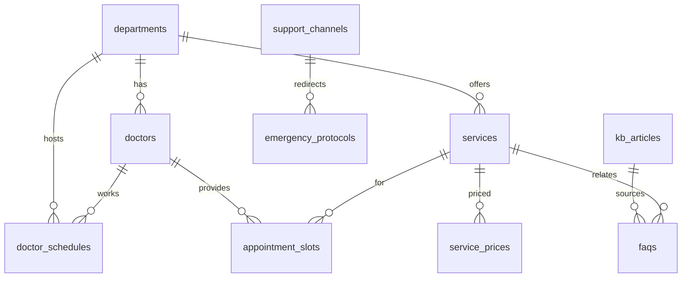

# 06 — Database Design

> **Mục đích:** lược đồ PostgreSQL (business data Spring Boot + session AI) + vector store Qdrant.
> **Đọc sau:** `00-hospital-domain-rules`, `02-business-analysis`, `01-project-overview` §6.
> Cập nhật: 2026-07-17 · Phiên bản: **v1.0** · Trạng thái: **Review** (owner: Spring Boot + AI).

---

## 1. Nguyên tắc thiết kế
1. **3 lớp, 1 PG container, 2 schema.** Spring Boot sở hữu **business master data** (`hospital`); FastAPI sở hữu **session/guardrail/eval** (`ai`) — dùng chung 1 container Postgres (DRY infra). Vector riêng Qdrant (AI team).
2. **Swappable adapter (ô 03).** FastAPI gọi qua interface `HospitalDataProvider`; demo impl = Spring Boot REST, prod impl = HIS API thật → không couple nội bộ demo.
3. **Structured cho fact, text cho KB.** Số liệu định lượng (giá, lịch, BHYT) → bảng cấu trúc (citation chính xác); nội dung dài (FAQ, bài viết, SOP) → `kb_articles` text → AI chunk+embed vào Qdrant.
4. **Không PII (R5).** Session vô danh, TTL ≤24h, xoá được. Không lưu CCCD/HS/chẩn đoán.
5. **Tên bảng snake_case** (Postgres); Spring Boot JPA map sang entity camelCase.

---

## 2. Sơ đồ quan hệ (ERD)



---

## 3. Schema `hospital` (Spring Boot — business master data)

### 3.1 Master / reference
| Bảng | Mục đích | Cột chính |
|---|---|---|
| `hospital_info` | Thông tin chung BV (1 hàng/khoá) | id, name, short_name, address, hotline, working_hours(jsonb), grade, established_year |
| `departments` | Chuyên khoa | id, code, name, name_en, description, floor, working_hours(jsonb), phone, sort_order, is_active |
| `doctors` | Bác sĩ | id, code, full_name, degree(TS/Ths/BS), title, department_id(fk), bio, avatar_url, is_active |
| `services` | Dịch vụ/khám/CLS | id, code, name, category(consultation/lab/imaging/procedure), department_id(fk), description, is_active |
| `service_prices` | Giá (citatable exact) | id, service_id(fk), price_vnd, audience(BHYT/no_bhyt/foreigner), effective_date, source_url, note |
| `support_channels` | Kênh đặt khám/hỗ trợ | id, channel_type(web/zalo/hotline/emergency), label, url, phone, sort_order, is_active |
| `priority_groups` | Đối tượng ưu tiên QĐ154 | id, code(QĐ154), name, description, sort_order |

### 3.2 Lịch & booking (mock)
| Bảng | Mục đích | Cột chính |
|---|---|---|
| `doctor_schedules` | Lịch khám/trực BS | id, doctor_id(fk), department_id(fk), day_of_week(0-6), start_time, end_time, shift(morning/afternoon), room, effective_from, effective_to, is_active |
| `appointment_slots` | Slot giả (mock booking) | id, doctor_id(fk), department_id(fk), date, start_time, end_time, capacity, booked_count, is_available |

> `appointment_slots` **chỉ mock demo**. Prod = HIS qua adapter (R6 — AI không tự đặt lịch nếu chưa có API thật).

### 3.3 Nội dung KB (source-of-truth text → feed vector store)
| Bảng | Mục đích | Cột chính |
|---|---|---|
| `procedures` | SOP QT.25.01 (11 bước) + QT.25.04 | id, code(QT.25.01), title, step_no, description, responsible_role, related_form, source_doc |
| `bhyt_policies` | Chính sách BHYT | id, code, title, category(cardiac/chronic/cross_ref/copay), summary, details_md, source_url, effective_date |
| `kb_articles` | Bài viết/FAQ crawl từ site | id, source_type(web/sop/form/faq), source_url, title, slug, body_md, category, tags(text[]), language, scraped_at, hash, is_published |
| `faqs` | Q&A (golden + content) | id, question, answer_md, category, related_article_id(fk), related_service_id(fk), source_url, is_golden |
| `emergency_protocols` | Xử lý cấp cứu HD.25.01 | id, code(HD.25.01), trigger_keywords(text[]), instruction_md, priority, redirect_channel_id(fk), is_active |

**Index:** `departments(code)`, `doctors(department_id)`, `services(category,department_id)`, `kb_articles(source_type,category)`, `faqs(category,is_golden)`. Full-text: `kb_articles` GIN `tsvector` (body) — hỗ trợ hybrid search phụ.

---

## 4. Schema `ai` (FastAPI — session/guardrail/eval, share PG container)

> ⚠️ **Trạng thái thực tế (2026-07-18):** schema `ai` hiện **CHƯA implement**. `chatbot-service/memory/session_memory.py` là **STUB no-op** (TODO) — `session_id` opaque, không lưu conversation, không có bảng nào tồn tại. Các bảng `chat_sessions`/`chat_messages` dưới đây (theo đề xuất gốc ADR-006/007) **chưa được tạo**.
>
> **Quyết định mới — Recommendation A / ADR-008 (lead-approved):** **chat persistence chuyển sang data-api, schema `hospital`** (Spring Boot + Flyway, đã có infra). Xem §4b bên dưới. Các bảng `guardrail_events` / `retrieval_logs` / `feedback` (concern AI eval) có thể vẫn nằm schema `ai` khi AI team cần — nhưng KHÔNG triển khai 48h (YAGNI).

| Bảng | Mục đích | Cột chính |
|---|---|---|
| `chat_sessions` | Phiên vô danh | id(uuid random), created_at, expires_at(≤24h), lang, deleted_at |
| `chat_messages` | Tin nhắn phiên | id, session_id(fk), role(user/assistant/system), content, citations(jsonb), created_at |
| `guardrail_events` | Sự kiện safety (ô 05) | id, session_id(fk), type(emergency/out_of_scope/refusal), detail, handled_at |
| `retrieval_logs` | Log retrieve (eval/observability) | id, session_id(fk), query, top_chunks(jsonb), scores(jsonb), latency_ms, created_at |
| `feedback` | Đánh giá BN (optional) | id, session_id(fk), message_id, rating, note, created_at |

**Retention job:** cron xoá `chat_sessions` + cascade khi `expires_at < now()` (R5). PII không bao giờ lưu.

---

## 4b. Schema `hospital` — **Chat persistence (ADR-008, Recommendation A)** — sở hữu data dev

> ⚠️ **MỚI (2026-07-18):** chat persistence do data-api sở hữu (Spring Boot, Flyway). Thay thế phần "chat thuộc schema `ai`" của ADR-006/007.

| Bảng | Mục đích | Cột chính |
|---|---|---|
| `chat_sessions` | Phiên chat (FE → data-api BFF) | `id` (uuid), `created_at`, `updated_at`, `lang`, `anon_token?` (nullable, cho phép re-load history ở trình duyệt khác), `user_id?` (nullable, khi có auth sau), `expires_at` (≤24h, NFR-2 / R5), `deleted_at?` |
| `chat_messages` | Tin nhắn phiên | `id`, `session_id` (fk→chat_sessions), `role` (user/assistant/system), `content` (text), `citations` (jsonb), `intent`, `route`, `guardrail_flags` (jsonb), `confidence`, `created_at` |

**Index:** `chat_sessions(anon_token)`, `chat_messages(session_id, created_at)`.
**Retention/TTL:** cron xoá `chat_sessions` + cascade khi `expires_at < now()` — theo NFR-2 / R5 (≤24h, anonymous, deletable). PII không bao giờ lưu (không CCCD/HS/chẩn đoán).
**Migration:** Flyway `V{n}__init_chat_tables.sql` trong `data-api/src/main/resources/db/migration`.

---

## 5. Vector store (Qdrant — AI team owns)
- **Collection:** `kb_chunks` (BGE-M3, dim 1024). Index HNSW (`m=16, ef_construct=100`).
- **Payload:** `{chunk_id, article_id, source_type, source_url, title, text, chunk_index, category, tags[], form_code, language}`.
- **Filter:** theo `source_type`, `category` (hybrid: vector + metadata filter).
- **Sync:** ingest pipeline đọc `kb_articles`/`faqs`/`procedures` (qua Spring Boot REST hoặc thẳng PG read-replica) → chunk → embed → upsert. Re-embed khi hash thay đổi.

---

## 6. Adapter pattern (swappable — ô 03)

```
FastAPI ──▶ HospitalDataProvider (interface)
              ├─ DemoHospitalDataProvider  ──REST──▶ Spring Boot /data/v1/* ──▶ PG (hospital)
              └─ HisHospitalDataProvider   ──▶ Hospital HIS API (prod)
```
- Interface ổn định; demo/prod swap qua env `DATA_PROVIDER=demo|his`.
- Spring Boot REST = nguồn dữ liệu cấu trúc cho demo (defensible: "seed data phản ánh thông tin công khai chính thức, thay được bằng HIS").

---

## 7. Data cần cung cấp (input) — xem chi tiết `brainstorming` + `00-team-working-guide`

| Bảng | Cần gì | Nguồn | Format | Folder |
|---|---|---|---|---|
| departments, doctors, schedules | DS chuyên khoa/BS/lịch | site BV | JSON | `data/seed/` |
| services, service_prices | danh mục + giá | bảng giá công khai | CSV | `data/seed/` |
| bhyt_policies | quyền lợi BHYT tim mạch | site BV + BHXH | Markdown | `data/content/bhyt/` |
| procedures | 11 bước SOP | `docs/refer/Quytrinh.md` | parse sẵn | (đã có) |
| kb_articles | crawl trang site | site BV | HTML→MD | `data/raw/` → `data/content/` |
| faqs (golden ≥30) | Q&A vàng | BA author | JSON | `data/seed/faqs.json` |
| support_channels | URL Zalo/Hotline/Web | site BV | JSON | `data/seed/` |
| emergency_protocols | HD.25.01 + từ khoá cấp cứu | SOP + y tế | MD + keywords | `data/content/` |

```
data/
├── raw/       ← scrape thô (gitignore nếu lớn)
├── content/   ← markdown curated: bhyt/, emergency/, procedures/
└── seed/      ← JSON/CSV/SQL nạp DB: doctors.json, services.csv, faqs.json...
```

> seed + content **commit** (source-of-truth demo, swappable). raw lớn → gitignore.

## 8. Migration
- **Flyway** (`V1__init_hospital.sql`, `V2__seed_*.sql`) cho schema `hospital` (Spring Boot).
- Schema `ai` migrate qua Alembic (FastAPI) hoặc chung Flyway `V1__init_ai.sql`.
- Seed dữ liệu cấu trúc từ `data/seed/*.json|csv` (Spring Boot `CommandLineRunner` / `@PostConstruct` loader, chỉ chạy `SPRING_PROFILES=seed`).

## 9. Liên quan
- [[00-data-strategy]] (KB vs DB + data inventory + gaps) · [[01-project-overview]] · [[02-business-analysis]] · [[05-system-architecture]] · [[07-api-design]]
- Nguồn gốc: `docs/refer/Quytrinh.md` · `docs/data/` (6 file raw)
