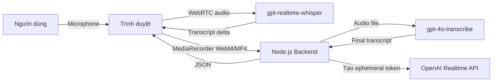
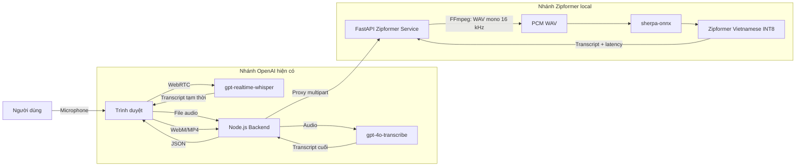

# Demo Speech-to-Text tiếng Việt với OpenAI Realtime và Zipformer Local

## 1. Mục tiêu

Xây dựng một giao diện web tối giản để thử nghiệm Speech-to-Text tiếng Việt. Tài liệu gồm nhánh OpenAI hai lượt ban đầu và phần mở rộng Zipformer chạy local:

1. **Lượt realtime:** dùng `gpt-realtime-whisper` để hiển thị văn bản tạm thời khi người dùng đang nói.
2. **Lượt chính xác:** khi người dùng bấm dừng, gửi file ghi âm lên backend và dùng `gpt-4o-transcribe` để tạo kết quả cuối.
3. **Nhánh local:** dùng `sherpa-onnx-zipformer-vi-30M-int8-2026-02-09` để nhận dạng tiếng Việt trên CPU mà không cần API key.

Giao diện chỉ cần:

- Nút **Bắt đầu ghi âm**.
- Nút **Dừng và xử lý**.
- Trạng thái kết nối.
- Thời gian ghi âm.
- Kết quả realtime.
- Kết quả cuối.
- Thông báo lỗi.

> Đây là bản thử nghiệm push-to-talk, chưa phải kiến trúc production.

---

## 2. Điểm cần hiểu trước khi làm

### 2.1. Không đưa API key vào frontend

Frontend chỉ nhận một **ephemeral token** có thời hạn ngắn từ backend. API key thật chỉ được lưu trong file `.env` trên server.

### 2.2. `gpt-realtime-whisper` hiện không dùng Server VAD

Với phiên transcription dùng `gpt-realtime-whisper`:

```json
{
  "turn_detection": null
}
```

Ứng dụng phải tự xác định lúc bắt đầu và kết thúc lượt nói. Trong demo này:

- Bấm **Bắt đầu ghi âm** để mở microphone.
- Bấm **Dừng và xử lý** để gửi sự kiện `input_audio_buffer.commit`.

### 2.3. Prompt chuyên ngành chỉ áp dụng cho lượt cuối

Trong GA Realtime hiện tại, prompt không được hỗ trợ cho `gpt-realtime-whisper`. Vì vậy:

- Realtime transcript dùng `language: "vi"` và `delay: "low"`.
- Prompt chứa tên riêng và thuật ngữ được truyền cho `gpt-4o-transcribe` khi xử lý file cuối.

### 2.4. Vì sao phải chạy hai lượt?

| Lượt | Model | Mục tiêu |
|---|---|---|
| Realtime | `gpt-realtime-whisper` | Hiển thị chữ nhanh để người dùng biết hệ thống đang nghe |
| Final | `gpt-4o-transcribe` | Tạo transcript chính xác hơn, có prompt thuật ngữ |

Không nên dùng transcript realtime làm dữ liệu nghiệp vụ cuối cùng, đặc biệt với số điện thoại, ngày sinh, mã bệnh nhân hoặc tên thuốc.

---

## 3. Kiến trúc demo



Luồng xử lý:

```text
Bấm bắt đầu
    ↓
Xin quyền microphone
    ↓
Backend tạo ephemeral token
    ↓
Frontend kết nối WebRTC tới OpenAI
    ↓
Audio vừa được stream realtime, vừa được MediaRecorder lưu lại
    ↓
Hiển thị transcript delta
    ↓
Bấm dừng
    ↓
Commit audio realtime
    ↓
Gửi file ghi âm về backend
    ↓
Backend gọi gpt-4o-transcribe
    ↓
Hiển thị transcript cuối
```

---

## 4. Công nghệ sử dụng

- Node.js 20 trở lên.
- Express.
- Multer để nhận file audio.
- HTML, CSS và JavaScript thuần.
- WebRTC cho realtime audio.
- MediaRecorder để lưu bản ghi dùng cho lượt final.

Không dùng React ở bản đầu vì mục tiêu hiện tại là kiểm chứng model và độ trễ, không phải xây UI hoàn chỉnh.

---

## 5. Cấu trúc thư mục

```text
openai-stt-demo/
├── public/
│   ├── index.html
│   ├── styles.css
│   └── app.js
├── .env
├── .env.example
├── .gitignore
├── package.json
└── server.js
```

---

## 6. Khởi tạo dự án

```bash
mkdir openai-stt-demo
cd openai-stt-demo

npm init -y
npm install express multer dotenv

mkdir public
```

Mở `package.json`, thêm `"type": "module"` và scripts:

```json
{
  "name": "openai-stt-demo",
  "version": "1.0.0",
  "type": "module",
  "scripts": {
    "dev": "node --watch server.js",
    "start": "node server.js"
  }
}
```

Không cần xóa trường `dependencies` mà npm đã tự thêm.

---

## 7. Cấu hình môi trường

### 7.1. File `.env.example`

```env
OPENAI_API_KEY=your_openai_api_key
PORT=3000

# Prompt này chỉ áp dụng cho gpt-4o-transcribe ở lượt final.
STT_DOMAIN_PROMPT=Cuộc hội thoại bằng tiếng Việt. Hãy chép lại chính xác, có dấu câu. Các thuật ngữ có thể xuất hiện gồm: Bệnh viện Tim Hà Nội, tim mạch, bảo hiểm y tế, BHYT, đặt lịch khám, tái khám, siêu âm tim, Holter điện tim, rung nhĩ, suy tim, động mạch vành.
```

### 7.2. File `.env`

Sao chép `.env.example` thành `.env` và thay API key thật:

```env
OPENAI_API_KEY=sk-xxxxxxxxxxxxxxxx
PORT=3000
STT_DOMAIN_PROMPT=Cuộc hội thoại bằng tiếng Việt. Hãy chép lại chính xác, có dấu câu. Các thuật ngữ có thể xuất hiện gồm: Bệnh viện Tim Hà Nội, tim mạch, bảo hiểm y tế, BHYT, đặt lịch khám, tái khám, siêu âm tim, Holter điện tim, rung nhĩ, suy tim, động mạch vành.
```

### 7.3. File `.gitignore`

```gitignore
node_modules/
.env
npm-debug.log*
```

Tuyệt đối không commit `.env` lên GitHub hoặc GitLab.

---

## 8. Backend: `server.js`

```javascript
import "dotenv/config";
import express from "express";
import multer from "multer";
import path from "node:path";
import { fileURLToPath } from "node:url";

const app = express();
const port = Number(process.env.PORT || 3000);
const apiKey = process.env.OPENAI_API_KEY;

if (!apiKey) {
  throw new Error("Thiếu biến môi trường OPENAI_API_KEY");
}

const __filename = fileURLToPath(import.meta.url);
const __dirname = path.dirname(__filename);

const upload = multer({
  storage: multer.memoryStorage(),
  limits: {
    fileSize: 25 * 1024 * 1024,
  },
});

const finalPrompt =
  process.env.STT_DOMAIN_PROMPT ||
  "Cuộc hội thoại bằng tiếng Việt. Hãy chép lại chính xác và thêm dấu câu phù hợp.";

app.use(express.json());
app.use(express.static(path.join(__dirname, "public")));

/**
 * Tạo ephemeral token cho trình duyệt kết nối trực tiếp
 * tới OpenAI Realtime API bằng WebRTC.
 */
app.get("/api/realtime-token", async (_req, res) => {
  const sessionConfig = {
    session: {
      type: "transcription",
      audio: {
        input: {
          transcription: {
            model: "gpt-realtime-whisper",
            language: "vi",
            delay: "low",
          },
          turn_detection: null,
          noise_reduction: {
            // Dùng far_field nếu thu bằng microphone laptop.
            // Đổi thành near_field nếu dùng tai nghe có microphone gần miệng.
            type: "far_field",
          },
        },
      },
    },
  };

  try {
    const response = await fetch(
      "https://api.openai.com/v1/realtime/client_secrets",
      {
        method: "POST",
        headers: {
          Authorization: `Bearer ${apiKey}`,
          "Content-Type": "application/json",
          // Với production, thay giá trị tĩnh bằng hash ID người dùng.
          "OpenAI-Safety-Identifier": "local-stt-demo-user",
        },
        body: JSON.stringify(sessionConfig),
      },
    );

    const responseText = await response.text();

    if (!response.ok) {
      console.error("Không tạo được realtime token:", responseText);
      return res.status(response.status).json({
        error: "Không tạo được realtime token",
        detail: responseText,
      });
    }

    const data = JSON.parse(responseText);
    return res.json(data);
  } catch (error) {
    console.error("Lỗi realtime token:", error);
    return res.status(500).json({
      error: "Lỗi server khi tạo realtime token",
    });
  }
});

/**
 * Nhận file MediaRecorder và gọi gpt-4o-transcribe
 * để tạo transcript cuối.
 */
app.post("/api/transcribe", upload.single("audio"), async (req, res) => {
  if (!req.file) {
    return res.status(400).json({ error: "Không nhận được file audio" });
  }

  if (req.file.size === 0) {
    return res.status(400).json({ error: "File audio rỗng" });
  }

  const mimeType = req.file.mimetype || "audio/webm";
  const filename = req.file.originalname || "recording.webm";

  const formData = new FormData();
  formData.append(
    "file",
    new Blob([req.file.buffer], { type: mimeType }),
    filename,
  );
  formData.append("model", "gpt-4o-transcribe");
  formData.append("language", "vi");
  formData.append("response_format", "json");
  formData.append("prompt", finalPrompt);

  try {
    const response = await fetch(
      "https://api.openai.com/v1/audio/transcriptions",
      {
        method: "POST",
        headers: {
          Authorization: `Bearer ${apiKey}`,
        },
        body: formData,
      },
    );

    const responseText = await response.text();

    if (!response.ok) {
      console.error("Lỗi final transcription:", responseText);
      return res.status(response.status).json({
        error: "Không thể tạo transcript cuối",
        detail: responseText,
      });
    }

    const data = JSON.parse(responseText);

    return res.json({
      text: data.text || "",
      model: "gpt-4o-transcribe",
      audioSizeBytes: req.file.size,
    });
  } catch (error) {
    console.error("Lỗi gọi transcription API:", error);
    return res.status(500).json({
      error: "Lỗi server khi xử lý audio",
    });
  }
});

app.use((error, _req, res, _next) => {
  if (error instanceof multer.MulterError) {
    return res.status(400).json({
      error: "File audio không hợp lệ",
      detail: error.message,
    });
  }

  console.error("Unhandled error:", error);
  return res.status(500).json({ error: "Lỗi server không xác định" });
});

app.listen(port, () => {
  console.log(`STT demo đang chạy tại http://localhost:${port}`);
});
```

---

## 9. Giao diện: `public/index.html`

```html
<!doctype html>
<html lang="vi">
  <head>
    <meta charset="UTF-8" />
    <meta name="viewport" content="width=device-width, initial-scale=1.0" />
    <title>Vietnamese Speech-to-Text Demo</title>
    <link rel="stylesheet" href="./styles.css" />
  </head>
  <body>
    <main class="container">
      <section class="card">
        <header>
          <p class="eyebrow">OPENAI SPEECH-TO-TEXT</p>
          <h1>Nhận dạng giọng nói tiếng Việt</h1>
          <p class="description">
            Realtime bằng gpt-realtime-whisper, kết quả cuối bằng
            gpt-4o-transcribe.
          </p>
        </header>

        <div class="status-row">
          <span id="statusDot" class="status-dot"></span>
          <span id="statusText">Chưa bắt đầu</span>
          <span id="timer" class="timer">00:00</span>
        </div>

        <div class="actions">
          <button id="startButton" class="button primary" type="button">
            Bắt đầu ghi âm
          </button>
          <button
            id="stopButton"
            class="button danger"
            type="button"
            disabled
          >
            Dừng và xử lý
          </button>
        </div>

        <section class="result-section">
          <div class="result-heading">
            <h2>Kết quả realtime</h2>
            <span class="badge">Tạm thời</span>
          </div>
          <div id="liveTranscript" class="transcript muted">
            Văn bản sẽ xuất hiện khi bạn bắt đầu nói.
          </div>
        </section>

        <section class="result-section">
          <div class="result-heading">
            <h2>Kết quả cuối</h2>
            <span class="badge final">Chính xác hơn</span>
          </div>
          <div id="finalTranscript" class="transcript muted">
            Kết quả cuối xuất hiện sau khi bạn bấm dừng.
          </div>
        </section>

        <div id="errorBox" class="error-box" hidden></div>

        <p class="hint">
          Hãy thử nói: “Tôi muốn đặt lịch khám tim mạch vào sáng thứ Hai.”
        </p>
      </section>
    </main>

    <script type="module" src="./app.js"></script>
  </body>
</html>
```

---

## 10. CSS: `public/styles.css`

```css
:root {
  font-family:
    Inter, system-ui, -apple-system, BlinkMacSystemFont, "Segoe UI", sans-serif;
  color: #18202a;
  background: #f3f6fa;
}

* {
  box-sizing: border-box;
}

body {
  margin: 0;
  min-height: 100vh;
}

button,
input,
textarea {
  font: inherit;
}

.container {
  min-height: 100vh;
  display: grid;
  place-items: center;
  padding: 32px 16px;
}

.card {
  width: min(760px, 100%);
  background: #ffffff;
  border: 1px solid #dfe6ee;
  border-radius: 20px;
  padding: 28px;
  box-shadow: 0 18px 45px rgba(31, 45, 61, 0.08);
}

.eyebrow {
  margin: 0 0 8px;
  font-size: 12px;
  font-weight: 700;
  letter-spacing: 0.12em;
  color: #52606d;
}

h1 {
  margin: 0;
  font-size: clamp(28px, 5vw, 42px);
  line-height: 1.15;
}

.description {
  margin: 12px 0 0;
  color: #52606d;
  line-height: 1.6;
}

.status-row {
  display: flex;
  align-items: center;
  gap: 10px;
  margin-top: 24px;
  padding: 12px 14px;
  border-radius: 12px;
  background: #f7f9fc;
  border: 1px solid #e5eaf0;
}

.status-dot {
  width: 10px;
  height: 10px;
  border-radius: 999px;
  background: #98a2b3;
}

.status-dot.active {
  background: #e5484d;
  box-shadow: 0 0 0 5px rgba(229, 72, 77, 0.12);
}

.status-dot.success {
  background: #2f9e62;
}

.timer {
  margin-left: auto;
  font-variant-numeric: tabular-nums;
  font-weight: 700;
}

.actions {
  display: flex;
  gap: 12px;
  margin-top: 18px;
}

.button {
  flex: 1;
  min-height: 48px;
  border: 0;
  border-radius: 12px;
  padding: 12px 18px;
  font-weight: 700;
  cursor: pointer;
  transition:
    transform 120ms ease,
    opacity 120ms ease;
}

.button:hover:not(:disabled) {
  transform: translateY(-1px);
}

.button:disabled {
  opacity: 0.45;
  cursor: not-allowed;
}

.primary {
  color: #ffffff;
  background: #2563eb;
}

.danger {
  color: #ffffff;
  background: #d92d20;
}

.result-section {
  margin-top: 24px;
}

.result-heading {
  display: flex;
  align-items: center;
  gap: 10px;
  margin-bottom: 10px;
}

.result-heading h2 {
  margin: 0;
  font-size: 17px;
}

.badge {
  padding: 4px 8px;
  border-radius: 999px;
  background: #eef2ff;
  color: #4338ca;
  font-size: 12px;
  font-weight: 700;
}

.badge.final {
  background: #eaf7ef;
  color: #18794e;
}

.transcript {
  min-height: 110px;
  padding: 16px;
  border-radius: 14px;
  border: 1px solid #dfe6ee;
  background: #fbfcfe;
  white-space: pre-wrap;
  line-height: 1.65;
}

.muted {
  color: #7b8794;
}

.error-box {
  margin-top: 18px;
  padding: 14px;
  border-radius: 12px;
  border: 1px solid #f3b7b9;
  background: #fff0f0;
  color: #b42318;
  white-space: pre-wrap;
}

.hint {
  margin: 20px 0 0;
  color: #667085;
  font-size: 14px;
}

@media (max-width: 600px) {
  .card {
    padding: 20px;
    border-radius: 16px;
  }

  .actions {
    flex-direction: column;
  }
}
```

---

## 11. Frontend logic: `public/app.js`

```javascript
const startButton = document.querySelector("#startButton");
const stopButton = document.querySelector("#stopButton");
const statusText = document.querySelector("#statusText");
const statusDot = document.querySelector("#statusDot");
const timerElement = document.querySelector("#timer");
const liveTranscriptElement = document.querySelector("#liveTranscript");
const finalTranscriptElement = document.querySelector("#finalTranscript");
const errorBox = document.querySelector("#errorBox");

let peerConnection = null;
let dataChannel = null;
let mediaStream = null;
let mediaRecorder = null;
let recordedChunks = [];
let selectedMimeType = "";
let timerInterval = null;
let startedAt = 0;
let liveTranscript = "";
let stopping = false;

startButton.addEventListener("click", startRecording);
stopButton.addEventListener("click", stopRecording);

async function startRecording() {
  resetError();
  stopping = false;
  liveTranscript = "";
  recordedChunks = [];

  setLiveTranscript("Đang kết nối...", true);
  setFinalTranscript("Chưa có kết quả cuối.", true);
  setStatus("Đang xin quyền microphone...");
  startButton.disabled = true;

  try {
    mediaStream = await navigator.mediaDevices.getUserMedia({
      audio: {
        echoCancellation: true,
        noiseSuppression: true,
        autoGainControl: true,
        channelCount: 1,
      },
    });

    setStatus("Đang tạo phiên realtime...");

    const tokenResponse = await fetch("/api/realtime-token");
    const tokenData = await readJsonResponse(tokenResponse);

    if (!tokenResponse.ok) {
      throw new Error(
        tokenData.detail || tokenData.error || "Không lấy được realtime token",
      );
    }

    const ephemeralKey = tokenData.value;

    if (!ephemeralKey) {
      throw new Error("Backend không trả về ephemeral token hợp lệ");
    }

    peerConnection = new RTCPeerConnection();
    dataChannel = peerConnection.createDataChannel("oai-events");

    dataChannel.addEventListener("message", handleRealtimeEvent);
    dataChannel.addEventListener("close", () => {
      if (!stopping) {
        setStatus("Kết nối realtime đã đóng");
      }
    });

    for (const track of mediaStream.getTracks()) {
      peerConnection.addTrack(track, mediaStream);
    }

    const offer = await peerConnection.createOffer();
    await peerConnection.setLocalDescription(offer);

    const sdpResponse = await fetch(
      "https://api.openai.com/v1/realtime/calls",
      {
        method: "POST",
        headers: {
          Authorization: `Bearer ${ephemeralKey}`,
          "Content-Type": "application/sdp",
        },
        body: offer.sdp,
      },
    );

    const answerSdp = await sdpResponse.text();

    if (!sdpResponse.ok) {
      throw new Error(`Không kết nối được Realtime API: ${answerSdp}`);
    }

    await peerConnection.setRemoteDescription({
      type: "answer",
      sdp: answerSdp,
    });

    await waitForDataChannelOpen(dataChannel, 10_000);

    selectedMimeType = chooseRecorderMimeType();
    mediaRecorder = selectedMimeType
      ? new MediaRecorder(mediaStream, { mimeType: selectedMimeType })
      : new MediaRecorder(mediaStream);

    mediaRecorder.addEventListener("dataavailable", (event) => {
      if (event.data.size > 0) {
        recordedChunks.push(event.data);
      }
    });

    // Lấy chunk mỗi 250 ms để giảm rủi ro mất toàn bộ bản ghi
    // nếu người dùng đóng tab bất ngờ.
    mediaRecorder.start(250);

    startedAt = Date.now();
    startTimer();

    statusDot.classList.add("active");
    statusDot.classList.remove("success");
    setStatus("Đang nghe — hãy bắt đầu nói");
    setLiveTranscript("", false);

    stopButton.disabled = false;
  } catch (error) {
    console.error(error);
    showError(error.message || "Không thể bắt đầu ghi âm");
    setStatus("Khởi tạo thất bại");
    cleanupResources();
    startButton.disabled = false;
    stopButton.disabled = true;
  }
}

async function stopRecording() {
  if (stopping) {
    return;
  }

  stopping = true;
  stopButton.disabled = true;
  stopTimer();
  setStatus("Đang hoàn tất audio...");

  try {
    if (dataChannel?.readyState === "open") {
      dataChannel.send(
        JSON.stringify({
          type: "input_audio_buffer.commit",
        }),
      );
    }

    // Ngừng gửi thêm âm thanh nhưng giữ kết nối trong lúc chờ
    // sự kiện transcript completed.
    for (const track of mediaStream?.getAudioTracks() || []) {
      track.enabled = false;
    }

    if (!mediaRecorder || mediaRecorder.state === "inactive") {
      throw new Error("MediaRecorder chưa hoạt động");
    }

    const recorderStopped = new Promise((resolve) => {
      mediaRecorder.addEventListener("stop", resolve, { once: true });
    });

    mediaRecorder.stop();
    await recorderStopped;

    const actualMimeType =
      mediaRecorder.mimeType || selectedMimeType || "audio/webm";

    const audioBlob = new Blob(recordedChunks, {
      type: actualMimeType,
    });

    if (audioBlob.size === 0) {
      throw new Error("Bản ghi âm rỗng. Hãy thử ghi âm lại.");
    }

    setStatus("Đang tạo transcript cuối...");
    setFinalTranscript("Đang xử lý bằng gpt-4o-transcribe...", true);

    const extension = actualMimeType.includes("mp4") ? "mp4" : "webm";
    const formData = new FormData();
    formData.append("audio", audioBlob, `recording.${extension}`);

    const response = await fetch("/api/transcribe", {
      method: "POST",
      body: formData,
    });

    const data = await readJsonResponse(response);

    if (!response.ok) {
      throw new Error(data.detail || data.error || "Transcription thất bại");
    }

    setFinalTranscript(data.text || "Không nhận dạng được nội dung.", false);
    setStatus("Đã xử lý xong");
    statusDot.classList.remove("active");
    statusDot.classList.add("success");

    // Cho realtime session thêm một khoảng ngắn để trả event completed.
    await sleep(500);
  } catch (error) {
    console.error(error);
    showError(error.message || "Không thể xử lý bản ghi âm");
    setStatus("Xử lý thất bại");
    statusDot.classList.remove("active");
  } finally {
    cleanupResources();
    startButton.disabled = false;
    stopButton.disabled = true;
    stopping = false;
  }
}

function handleRealtimeEvent(messageEvent) {
  let event;

  try {
    event = JSON.parse(messageEvent.data);
  } catch {
    return;
  }

  if (
    event.type === "conversation.item.input_audio_transcription.delta" &&
    typeof event.delta === "string"
  ) {
    liveTranscript += event.delta;
    setLiveTranscript(liveTranscript, false);
    return;
  }

  if (
    event.type === "conversation.item.input_audio_transcription.completed" &&
    typeof event.transcript === "string"
  ) {
    liveTranscript = event.transcript;
    setLiveTranscript(liveTranscript, false);
    return;
  }

  if (event.type === "error") {
    const message =
      event.error?.message || JSON.stringify(event.error || event, null, 2);
    showError(`Realtime API: ${message}`);
  }
}

function chooseRecorderMimeType() {
  const candidates = [
    "audio/webm;codecs=opus",
    "audio/webm",
    "audio/mp4",
  ];

  return (
    candidates.find((type) => MediaRecorder.isTypeSupported(type)) || ""
  );
}

function waitForDataChannelOpen(channel, timeoutMs) {
  if (channel.readyState === "open") {
    return Promise.resolve();
  }

  return new Promise((resolve, reject) => {
    const timeoutId = window.setTimeout(() => {
      reject(new Error("Data channel không mở trong thời gian cho phép"));
    }, timeoutMs);

    channel.addEventListener(
      "open",
      () => {
        window.clearTimeout(timeoutId);
        resolve();
      },
      { once: true },
    );
  });
}

async function readJsonResponse(response) {
  const text = await response.text();

  if (!text) {
    return {};
  }

  try {
    return JSON.parse(text);
  } catch {
    return { detail: text };
  }
}

function startTimer() {
  stopTimer();
  updateTimer();
  timerInterval = window.setInterval(updateTimer, 250);
}

function stopTimer() {
  if (timerInterval) {
    window.clearInterval(timerInterval);
    timerInterval = null;
  }
}

function updateTimer() {
  const elapsedSeconds = Math.floor((Date.now() - startedAt) / 1000);
  const minutes = String(Math.floor(elapsedSeconds / 60)).padStart(2, "0");
  const seconds = String(elapsedSeconds % 60).padStart(2, "0");
  timerElement.textContent = `${minutes}:${seconds}`;
}

function cleanupResources() {
  stopTimer();

  if (dataChannel) {
    try {
      dataChannel.close();
    } catch {
      // Không cần xử lý thêm.
    }
  }

  if (peerConnection) {
    try {
      peerConnection.close();
    } catch {
      // Không cần xử lý thêm.
    }
  }

  for (const track of mediaStream?.getTracks() || []) {
    track.stop();
  }

  peerConnection = null;
  dataChannel = null;
  mediaStream = null;
  mediaRecorder = null;
  recordedChunks = [];
}

function setStatus(text) {
  statusText.textContent = text;
}

function setLiveTranscript(text, muted) {
  liveTranscriptElement.textContent = text;
  liveTranscriptElement.classList.toggle("muted", muted);
}

function setFinalTranscript(text, muted) {
  finalTranscriptElement.textContent = text;
  finalTranscriptElement.classList.toggle("muted", muted);
}

function showError(message) {
  errorBox.textContent = message;
  errorBox.hidden = false;
}

function resetError() {
  errorBox.textContent = "";
  errorBox.hidden = true;
}

function sleep(milliseconds) {
  return new Promise((resolve) => window.setTimeout(resolve, milliseconds));
}
```

---

## 12. Chạy dự án

```bash
npm run dev
```

Truy cập:

```text
http://localhost:3000
```

Trình duyệt sẽ yêu cầu quyền dùng microphone. Chọn **Allow/Cho phép**.

Quy trình test:

1. Bấm **Bắt đầu ghi âm**.
2. Đợi trạng thái chuyển thành `Đang nghe — hãy bắt đầu nói`.
3. Nói một câu tiếng Việt.
4. Quan sát vùng **Kết quả realtime**.
5. Bấm **Dừng và xử lý**.
6. Đợi vùng **Kết quả cuối** được cập nhật.
7. So sánh hai transcript.

---

## 13. Các câu nên dùng để thử

### Câu thông thường

```text
Xin chào, hôm nay thời tiết khá đẹp và tôi đang thử chức năng nhận dạng giọng nói tiếng Việt.
```

### Câu nghiệp vụ bệnh viện

```text
Tôi muốn đặt lịch khám tim mạch vào sáng thứ Hai tại Bệnh viện Tim Hà Nội.
```

```text
Cho tôi hỏi bảo hiểm y tế có được áp dụng khi siêu âm tim và đo Holter điện tim không?
```

### Câu chứa ngày giờ

```text
Tôi muốn đặt lịch vào lúc tám giờ ba mươi sáng ngày hai mươi ba tháng bảy năm hai nghìn không trăm hai mươi sáu.
```

### Câu chứa số điện thoại

```text
Số điện thoại của tôi là không chín tám sáu, một hai ba, bốn năm sáu.
```

Không chỉ nhìn transcript có “đọc được” hay không. Hãy kiểm tra riêng:

- Tên riêng.
- Dấu tiếng Việt.
- Dấu câu.
- Chữ số.
- Ngày giờ.
- Từ viết tắt như BHYT.
- Thuật ngữ chuyên ngành.

---

## 14. Cách đánh giá kết quả

Tạo bảng test đơn giản:

| STT | Câu gốc | Realtime transcript | Final transcript | Realtime đúng? | Final đúng? | Lỗi |
|---:|---|---|---|---|---|---|
| 1 | Tôi muốn đặt lịch khám tim mạch. | ... | ... | Có/Không | Có/Không | Sai dấu |

Nên ghi thêm:

- Thời điểm bấm bắt đầu.
- Thời điểm xuất hiện chữ realtime đầu tiên.
- Thời điểm bấm dừng.
- Thời điểm final transcript xuất hiện.
- Microphone sử dụng.
- Môi trường yên tĩnh hay có tiếng ồn.
- Giọng Bắc, Trung hoặc Nam.

Các chỉ số tối thiểu:

```text
First partial latency
Final transcript latency
CER
WER
Độ chính xác chữ số
Độ chính xác tên riêng
```

Đừng kết luận model tốt chỉ sau vài câu. Tối thiểu nên test 50–100 câu trước khi chọn cấu hình.

---

## 15. Điều chỉnh tốc độ và độ chính xác

Trong `server.js`:

```javascript
transcription: {
  model: "gpt-realtime-whisper",
  language: "vi",
  delay: "low",
}
```

Các mức `delay`:

| Giá trị | Đặc điểm |
|---|---|
| `minimal` | Chữ xuất hiện sớm nhất nhưng dễ thay đổi và sai hơn |
| `low` | Phù hợp để test live caption |
| `medium` | Cân bằng tốc độ và độ chính xác |
| `high` | Chậm hơn, có thêm ngữ cảnh |
| `xhigh` | Ưu tiên độ chính xác hơn phản hồi tức thời |

Nên bắt đầu bằng `low`, sau đó test lại bằng `medium`. Không được chọn theo cảm giác từ một câu duy nhất.

---

## 16. Tùy chỉnh giảm nhiễu

Trong `server.js`:

```javascript
noise_reduction: {
  type: "far_field",
}
```

Chọn:

- `far_field`: microphone laptop, microphone để xa miệng, phòng họp.
- `near_field`: tai nghe hoặc microphone đặt gần miệng.

Nếu âm thanh đã được thiết bị hoặc phần mềm xử lý mạnh, hãy thử tắt giảm nhiễu phía OpenAI để so sánh:

```javascript
noise_reduction: null
```

Không có cấu hình nào luôn tốt hơn. Phải benchmark với đúng microphone sẽ dùng thực tế.

---

## 17. Tùy chỉnh prompt final

Biến môi trường:

```env
STT_DOMAIN_PROMPT=Cuộc hội thoại bằng tiếng Việt trong bối cảnh bệnh viện. Hãy chép lại chính xác, có dấu câu. Các thuật ngữ có thể xuất hiện gồm: Bệnh viện Tim Hà Nội, tim mạch can thiệp, điện sinh lý, Holter điện tim, bảo hiểm y tế, BHYT, rung nhĩ, suy tim, động mạch vành.
```

Không nên nhét hàng nghìn thuật ngữ vào prompt. Chỉ đưa những từ:

- Thực sự có khả năng xuất hiện.
- Dễ bị viết sai.
- Quan trọng đối với nghiệp vụ.

Prompt không biến model thành bộ kiểm tra nghiệp vụ. Transcript vẫn phải được xác nhận lại với dữ liệu quan trọng.

---

## 18. Các lỗi thường gặp

### 18.1. `401 Unauthorized`

Nguyên nhân có thể:

- API key sai.
- API key đã bị thu hồi.
- `.env` chưa được load.
- Server chưa được khởi động lại sau khi sửa `.env`.

Kiểm tra:

```bash
node -e "require('dotenv').config(); console.log(Boolean(process.env.OPENAI_API_KEY))"
```

Không in toàn bộ API key ra terminal hoặc log.

### 18.2. Không xin được quyền microphone

Kiểm tra:

- Quyền microphone trong Chrome hoặc Edge.
- Windows Privacy Settings.
- Thiết bị input mặc định.
- Trang web có chạy trên `localhost` hoặc HTTPS hay không.

Microphone thường không hoạt động trên HTTP ở domain thật. `localhost` là ngoại lệ phục vụ phát triển.

### 18.3. Kết nối được nhưng không có realtime transcript

Kiểm tra lần lượt:

1. Data channel có chuyển sang `open` không.
2. Console trình duyệt có event `error` không.
3. Tài khoản API có quyền dùng model không.
4. Khi bấm dừng có gửi `input_audio_buffer.commit` không.
5. Microphone track có thực sự nhận âm thanh không.

### 18.4. Realtime có chữ nhưng final transcript rỗng

Kiểm tra:

- `audioBlob.size` có lớn hơn `0` không.
- Request `/api/transcribe` có nhận file không.
- Trình duyệt đang ghi `webm` hay `mp4`.
- File có vượt giới hạn 25 MB không.

### 18.5. Prompt không sửa được realtime transcript

Đây không phải lỗi code. Prompt chuyên ngành không được áp dụng cho `gpt-realtime-whisper` trong GA Realtime hiện tại. Hãy đánh giá hiệu quả prompt trên vùng **Kết quả cuối**.

### 18.6. Transcript số điện thoại sai

Không nên chỉ dựa vào STT. Sau khi nhận dạng:

1. Chuẩn hóa chuỗi số.
2. Kiểm tra độ dài.
3. Hiển thị lại cho người dùng.
4. Yêu cầu người dùng xác nhận.

Ví dụ:

```text
Tôi nghe được số điện thoại là 0986 123 456. Thông tin này có đúng không?
```

---

## 19. Giới hạn của demo

Bản demo này chưa có:

- Đăng nhập người dùng.
- Rate limiting.
- Theo dõi chi phí.
- Lưu lịch sử transcript.
- Tự động VAD ở frontend.
- Tự chia đoạn nói dài.
- Retry khi WebRTC bị ngắt.
- Theo dõi P50/P95 latency.
- Chuẩn hóa số điện thoại và ngày giờ.
- Cơ chế xác nhận thông tin nhạy cảm.
- Test tự động.

Không nên đưa nguyên bản demo lên production.

---

## 20. Hướng nâng cấp sau khi test thành công

### Giai đoạn 1: đo lường

- Ghi lại thời gian xuất hiện delta đầu tiên.
- Ghi lại thời gian final transcript hoàn tất.
- Lưu realtime transcript và final transcript để so sánh.
- Tạo bộ 100 câu tiếng Việt đại diện cho người dùng thực tế.

### Giai đoạn 2: cải thiện UX

- Hiển thị waveform.
- Thêm nút hủy bản ghi.
- Thêm phát lại audio.
- Hiển thị kích thước file và thời lượng.
- Thêm lựa chọn `low` hoặc `medium` cho delay.

### Giai đoạn 3: tăng độ chính xác nghiệp vụ

- Chuẩn hóa ngày giờ.
- Chuẩn hóa số điện thoại.
- Từ điển tên bác sĩ và chuyên khoa.
- Xác nhận lại thông tin quan trọng.
- Đánh dấu từ có độ tin cậy thấp nếu API/model hỗ trợ dữ liệu cần thiết.

### Giai đoạn 4: tích hợp chatbot

```text
Final transcript
    ↓
Validate input
    ↓
Intent/entity extraction
    ↓
Chatbot workflow
    ↓
Phản hồi cho người dùng
```

Chỉ gửi **final transcript** vào workflow nghiệp vụ. Realtime transcript chủ yếu phục vụ trải nghiệm giao diện.

---

## 21. Tiêu chí hoàn thành bản thử nghiệm

Bản demo được coi là chạy đúng khi:

- API key không xuất hiện trong source frontend.
- Trình duyệt kết nối được WebRTC.
- Khi nói, giao diện nhận được transcript delta.
- Khi bấm dừng, audio được commit.
- Backend nhận được file audio không rỗng.
- `gpt-4o-transcribe` trả kết quả cuối.
- Người dùng có thể ghi âm lượt mới mà không cần tải lại trang.
- Lỗi API được hiển thị thay vì khiến UI treo.

---

## 22. Tài liệu chính thức

- Realtime transcription:  
  https://developers.openai.com/api/docs/guides/realtime-transcription

- Realtime API với WebRTC:  
  https://developers.openai.com/api/docs/guides/realtime-webrtc

- Speech-to-text và file transcription:  
  https://developers.openai.com/api/docs/guides/speech-to-text

- Model `gpt-realtime-whisper`:  
  https://developers.openai.com/api/docs/models/gpt-realtime-whisper

- Model `gpt-4o-transcribe`:  
  https://developers.openai.com/api/docs/models/gpt-4o-transcribe

---

## 23. Kết luận

Với mục tiêu kiểm thử nhanh, kiến trúc phù hợp là:

```text
WebRTC + gpt-realtime-whisper
            ↓
     Transcript tạm thời

MediaRecorder + gpt-4o-transcribe
            ↓
       Transcript cuối
```

Cấu hình khởi đầu:

```text
Realtime language: vi
Realtime delay: low
Realtime turn detection: null
Noise reduction: far_field với microphone laptop
Final model: gpt-4o-transcribe
Final prompt: danh sách thuật ngữ ngắn, đúng domain
```

Sau khi chạy được demo, việc quan trọng nhất không phải thêm tính năng mà là tạo bộ audio tiếng Việt thực tế để đo tốc độ và độ chính xác. Nếu không có benchmark, mọi nhận xét “model này tốt hơn” chỉ là cảm giác.
---

# Phần mở rộng: tích hợp Zipformer tiếng Việt chạy local

## 24. Mục tiêu của phần mở rộng

Phần này bổ sung model sau vào dự án đã xây dựng ở trên:

```text
sherpa-onnx-zipformer-vi-30M-int8-2026-02-09
```

Mục tiêu:

- Giữ nguyên trang demo OpenAI hiện có.
- Thêm một trang UI riêng để thử Zipformer.
- Chạy nhận dạng tiếng Việt hoàn toàn trên máy local bằng CPU.
- Không cần `OPENAI_API_KEY` khi chỉ dùng trang Zipformer.
- Đo được thời gian inference và tổng thời gian xử lý.
- Tránh sửa quá nhiều code OpenAI đang chạy ổn định.

Model này là một **offline transducer** trong sherpa-onnx. Vì vậy, bản tích hợp đầu tiên hoạt động theo luồng:

```text
Bắt đầu ghi âm → Dừng ghi âm → Gửi file → Nhận transcript
```

Nó chưa trả token liên tục khi người dùng đang nói. Sherpa-onnx có WebSocket và VAD để xây simulated streaming, nhưng nên làm sau khi kiểm chứng chất lượng model offline.

> Cảnh báo giấy phép: model card hiện ghi `CC-BY-NC-ND-4.0`. Phù hợp hơn cho học tập, nghiên cứu và demo phi thương mại. Không nên mặc định được phép đưa vào sản phẩm thương mại.

---

## 25. Kiến trúc sau khi bổ sung Zipformer



Lý do dùng Node.js làm proxy:

- Frontend tiếp tục gọi cùng domain `localhost:3000`.
- Không cần cấu hình CORS cho bản demo.
- Có thể thay Zipformer service bằng model khác mà không sửa frontend nhiều.
- Dễ thêm authentication, rate limit và logging sau này.

---

## 26. Cấu trúc thư mục cập nhật

```text
openai-stt-demo/
├── public/
│   ├── index.html
│   ├── styles.css
│   ├── app.js
│   ├── zipformer.html       # Trang test Zipformer mới
│   └── zipformer.js         # Logic ghi âm và gọi Zipformer
├── zipformer-service/
│   ├── app.py
│   ├── requirements.txt
│   └── models/
│       └── sherpa-onnx-zipformer-vi-30M-int8-2026-02-09/
│           ├── encoder.int8.onnx
│           ├── decoder.onnx
│           ├── joiner.int8.onnx
│           ├── tokens.txt
│           ├── bpe.model
│           └── test_wavs/
├── .env
├── .env.example
├── .gitignore
├── package.json
└── server.js
```

Không commit thư mục model vào Git vì file model lớn và giấy phép cần được xem xét riêng.

Bổ sung vào `.gitignore`:

```gitignore
zipformer-service/.venv/
zipformer-service/__pycache__/
zipformer-service/models/
*.wav
*.webm
*.mp4
```

---

## 27. Yêu cầu môi trường

Cần cài:

- Node.js 20 trở lên, như dự án cũ.
- Python 3.11 được khuyến nghị.
- FFmpeg.
- `sherpa-onnx`.
- FastAPI và Uvicorn.

### Windows

Kiểm tra Python:

```powershell
python --version
```

Kiểm tra FFmpeg:

```powershell
ffmpeg -version
```

Có thể cài FFmpeg bằng Windows Package Manager:

```powershell
winget install Gyan.FFmpeg
```

Sau khi cài, đóng terminal cũ và mở terminal mới.

### Ubuntu/Debian

```bash
sudo apt update
sudo apt install -y ffmpeg python3-venv wget bzip2
```

---

## 28. Tải model Zipformer

Di chuyển vào thư mục service:

```bash
cd openai-stt-demo/zipformer-service
mkdir -p models
cd models
```

### Linux/macOS/Git Bash

```bash
wget https://github.com/k2-fsa/sherpa-onnx/releases/download/asr-models/sherpa-onnx-zipformer-vi-30M-int8-2026-02-09.tar.bz2

tar xvf sherpa-onnx-zipformer-vi-30M-int8-2026-02-09.tar.bz2

rm sherpa-onnx-zipformer-vi-30M-int8-2026-02-09.tar.bz2
```

### Windows PowerShell

```powershell
Invoke-WebRequest `
  -Uri "https://github.com/k2-fsa/sherpa-onnx/releases/download/asr-models/sherpa-onnx-zipformer-vi-30M-int8-2026-02-09.tar.bz2" `
  -OutFile "sherpa-onnx-zipformer-vi-30M-int8-2026-02-09.tar.bz2"

tar -xvf sherpa-onnx-zipformer-vi-30M-int8-2026-02-09.tar.bz2

Remove-Item sherpa-onnx-zipformer-vi-30M-int8-2026-02-09.tar.bz2
```

Kiểm tra bốn file bắt buộc:

```text
encoder.int8.onnx
decoder.onnx
joiner.int8.onnx
tokens.txt
```

Model INT8 có encoder và joiner đã lượng tử hóa, phù hợp để thử inference trên CPU.

---

## 29. Tạo môi trường Python

Trong thư mục `zipformer-service`:

### Windows PowerShell

```powershell
python -m venv .venv
.\.venv\Scripts\Activate.ps1
```

Nếu PowerShell chặn script:

```powershell
Set-ExecutionPolicy -Scope Process -ExecutionPolicy Bypass
.\.venv\Scripts\Activate.ps1
```

### Linux/macOS

```bash
python3 -m venv .venv
source .venv/bin/activate
```

Tạo file `zipformer-service/requirements.txt`:

```txt
fastapi
uvicorn[standard]
python-multipart
numpy
sherpa-onnx
```

Cài dependency:

```bash
python -m pip install --upgrade pip
pip install -r requirements.txt
```

Không cần cài PyTorch vì bản này chạy các file ONNX thông qua sherpa-onnx.

---

## 30. FastAPI service: `zipformer-service/app.py`

```python
from __future__ import annotations

import os
import shutil
import subprocess
import tempfile
import threading
import time
import wave
from pathlib import Path

import numpy as np
import sherpa_onnx
from fastapi import FastAPI, File, HTTPException, UploadFile
from fastapi.concurrency import run_in_threadpool

BASE_DIR = Path(__file__).resolve().parent
DEFAULT_MODEL_DIR = (
    BASE_DIR
    / "models"
    / "sherpa-onnx-zipformer-vi-30M-int8-2026-02-09"
)
MODEL_DIR = Path(
    os.getenv("ZIPFORMER_MODEL_DIR", str(DEFAULT_MODEL_DIR))
).resolve()

MAX_AUDIO_SIZE_BYTES = int(
    os.getenv("ZIPFORMER_MAX_AUDIO_BYTES", str(25 * 1024 * 1024))
)
NUM_THREADS = max(1, int(os.getenv("ZIPFORMER_NUM_THREADS", "2")))

ENCODER_PATH = MODEL_DIR / "encoder.int8.onnx"
DECODER_PATH = MODEL_DIR / "decoder.onnx"
JOINER_PATH = MODEL_DIR / "joiner.int8.onnx"
TOKENS_PATH = MODEL_DIR / "tokens.txt"


def require_file(path: Path) -> None:
    if not path.is_file():
        raise RuntimeError(f"Không tìm thấy file model: {path}")


for required_path in (
    ENCODER_PATH,
    DECODER_PATH,
    JOINER_PATH,
    TOKENS_PATH,
):
    require_file(required_path)

if shutil.which("ffmpeg") is None:
    raise RuntimeError(
        "Không tìm thấy FFmpeg trong PATH. Hãy cài FFmpeg trước khi chạy service."
    )

print(f"Đang tải Zipformer từ: {MODEL_DIR}")
model_load_started = time.perf_counter()

recognizer = sherpa_onnx.OfflineRecognizer.from_transducer(
    encoder=str(ENCODER_PATH),
    decoder=str(DECODER_PATH),
    joiner=str(JOINER_PATH),
    tokens=str(TOKENS_PATH),
    num_threads=NUM_THREADS,
    sample_rate=16000,
    feature_dim=80,
    decoding_method="greedy_search",
    provider="cpu",
    debug=False,
)

MODEL_LOAD_MS = round((time.perf_counter() - model_load_started) * 1000, 2)
print(f"Đã tải Zipformer trong {MODEL_LOAD_MS} ms")

# OfflineRecognizer không nên bị nhiều request ghi vào đồng thời trong demo.
# Lock này ưu tiên tính đúng đắn hơn throughput.
recognizer_lock = threading.Lock()

app = FastAPI(
    title="Vietnamese Zipformer STT Service",
    version="1.0.0",
)


def convert_to_pcm_wav(input_path: Path, output_path: Path) -> None:
    command = [
        "ffmpeg",
        "-hide_banner",
        "-loglevel",
        "error",
        "-y",
        "-i",
        str(input_path),
        "-vn",
        "-ac",
        "1",
        "-ar",
        "16000",
        "-c:a",
        "pcm_s16le",
        str(output_path),
    ]

    completed = subprocess.run(
        command,
        capture_output=True,
        text=True,
        timeout=60,
        check=False,
    )

    if completed.returncode != 0:
        detail = completed.stderr.strip() or "FFmpeg không thể chuyển đổi audio"
        raise RuntimeError(detail)


def read_pcm16_wav(wav_path: Path) -> tuple[int, np.ndarray]:
    with wave.open(str(wav_path), "rb") as wav_file:
        channels = wav_file.getnchannels()
        sample_width = wav_file.getsampwidth()
        sample_rate = wav_file.getframerate()
        frame_count = wav_file.getnframes()
        pcm_bytes = wav_file.readframes(frame_count)

    if channels != 1:
        raise RuntimeError(f"Audio sau chuyển đổi không phải mono: {channels} kênh")

    if sample_width != 2:
        raise RuntimeError(
            f"Audio sau chuyển đổi không phải PCM 16-bit: {sample_width * 8}-bit"
        )

    samples = np.frombuffer(pcm_bytes, dtype=np.int16)
    samples = samples.astype(np.float32) / 32768.0

    if samples.size == 0:
        raise RuntimeError("Audio không chứa mẫu âm thanh")

    return sample_rate, samples


def decode_wav(wav_path: Path) -> dict[str, object]:
    sample_rate, samples = read_pcm16_wav(wav_path)
    audio_duration_seconds = samples.size / sample_rate

    inference_started = time.perf_counter()

    with recognizer_lock:
        stream = recognizer.create_stream()
        stream.accept_waveform(sample_rate, samples)
        recognizer.decode_stream(stream)
        text = stream.result.text.strip()

    inference_seconds = time.perf_counter() - inference_started
    real_time_factor = (
        inference_seconds / audio_duration_seconds
        if audio_duration_seconds > 0
        else None
    )

    return {
        "text": text,
        "audioDurationSeconds": round(audio_duration_seconds, 3),
        "inferenceMs": round(inference_seconds * 1000, 2),
        "realTimeFactor": (
            round(real_time_factor, 4)
            if real_time_factor is not None
            else None
        ),
    }


@app.get("/health")
def health() -> dict[str, object]:
    return {
        "status": "ok",
        "model": MODEL_DIR.name,
        "provider": "cpu",
        "numThreads": NUM_THREADS,
        "modelLoadMs": MODEL_LOAD_MS,
    }


@app.post("/transcribe")
async def transcribe(
    audio: UploadFile = File(...),
) -> dict[str, object]:
    request_started = time.perf_counter()
    audio_bytes = await audio.read()

    if not audio_bytes:
        raise HTTPException(status_code=400, detail="File audio rỗng")

    if len(audio_bytes) > MAX_AUDIO_SIZE_BYTES:
        raise HTTPException(
            status_code=413,
            detail=f"File audio vượt quá {MAX_AUDIO_SIZE_BYTES} byte",
        )

    original_suffix = Path(audio.filename or "recording.webm").suffix
    suffix = original_suffix if original_suffix else ".webm"

    try:
        with tempfile.TemporaryDirectory(prefix="zipformer-stt-") as temp_dir:
            temp_path = Path(temp_dir)
            input_path = temp_path / f"input{suffix}"
            wav_path = temp_path / "audio.wav"

            input_path.write_bytes(audio_bytes)

            await run_in_threadpool(convert_to_pcm_wav, input_path, wav_path)
            result = await run_in_threadpool(decode_wav, wav_path)

        total_ms = round((time.perf_counter() - request_started) * 1000, 2)

        return {
            **result,
            "model": MODEL_DIR.name,
            "totalMs": total_ms,
            "audioSizeBytes": len(audio_bytes),
        }
    except subprocess.TimeoutExpired as error:
        raise HTTPException(
            status_code=408,
            detail="FFmpeg xử lý audio quá thời gian cho phép",
        ) from error
    except RuntimeError as error:
        raise HTTPException(status_code=422, detail=str(error)) from error
    except Exception as error:
        raise HTTPException(
            status_code=500,
            detail="Zipformer service gặp lỗi không xác định",
        ) from error
```

### Vì sao model được tải khi service khởi động?

Nếu tải model trong từng request:

- Request đầu và các request sau đều chậm.
- Tốn CPU và RAM không cần thiết.
- Dễ sinh lỗi khi nhiều request đồng thời.

Service trên chỉ tải model một lần rồi tái sử dụng recognizer.

### Vì sao dùng lock?

Bản demo chỉ cần một người thử tại một thời điểm. Lock giúp tránh hai request cùng sử dụng recognizer không an toàn. Khi cần tải cao, phải benchmark rồi dùng worker/process pool hoặc nhiều instance service thay vì xóa lock tùy tiện.

---

## 31. Chạy và kiểm tra Zipformer service

Trong thư mục `zipformer-service` và đã kích hoạt virtual environment:

```bash
uvicorn app:app --host 127.0.0.1 --port 8001 --reload
```

Mở endpoint kiểm tra:

```text
http://127.0.0.1:8001/health
```

Kết quả mẫu:

```json
{
  "status": "ok",
  "model": "sherpa-onnx-zipformer-vi-30M-int8-2026-02-09",
  "provider": "cpu",
  "numThreads": 2,
  "modelLoadMs": 420.51
}
```

Con số thời gian chỉ là ví dụ. Không dùng nó làm benchmark cho máy thật.

Kiểm tra bằng file có sẵn:

```bash
curl -X POST \
  -F "audio=@models/sherpa-onnx-zipformer-vi-30M-int8-2026-02-09/test_wavs/0.wav" \
  http://127.0.0.1:8001/transcribe
```

PowerShell:

```powershell
curl.exe -X POST `
  -F "audio=@models/sherpa-onnx-zipformer-vi-30M-int8-2026-02-09/test_wavs/0.wav" `
  http://127.0.0.1:8001/transcribe
```

Không tích hợp UI cho tới khi `/health` và request file WAV đều chạy thành công.

---

## 32. Cập nhật `.env.example` và `.env`

Bổ sung:

```env
ZIPFORMER_SERVICE_URL=http://127.0.0.1:8001
```

File `.env.example` sau khi bổ sung có thể là:

```env
OPENAI_API_KEY=your_openai_api_key
PORT=3000
ZIPFORMER_SERVICE_URL=http://127.0.0.1:8001
STT_DOMAIN_PROMPT=Cuộc hội thoại bằng tiếng Việt. Hãy chép lại chính xác, có dấu câu.
```

Khi chỉ test Zipformer, có thể bỏ trống OpenAI key. Tuy nhiên, phải sửa kiểm tra API key trong `server.js` như phần tiếp theo; nếu không server cũ sẽ dừng ngay khi thiếu key.

---

## 33. Sửa `server.js` để OpenAI key trở thành tùy chọn

Trong code cũ, thay:

```javascript
if (!apiKey) {
  throw new Error("Thiếu biến môi trường OPENAI_API_KEY");
}
```

bằng:

```javascript
const openaiEnabled = Boolean(apiKey);

if (!openaiEnabled) {
  console.warn(
    "OPENAI_API_KEY chưa được cấu hình. Trang Zipformer vẫn sử dụng được.",
  );
}
```

Ở đầu hai endpoint OpenAI, thêm kiểm tra sau:

```javascript
if (!openaiEnabled) {
  return res.status(503).json({
    error: "OpenAI chưa được cấu hình",
  });
}
```

Cụ thể phải thêm vào:

- `GET /api/realtime-token`
- `POST /api/transcribe`

Không thêm kiểm tra này vào endpoint Zipformer.

---

## 34. Thêm proxy Zipformer vào `server.js`

Sau biến `finalPrompt`, thêm:

```javascript
const zipformerServiceUrl =
  process.env.ZIPFORMER_SERVICE_URL || "http://127.0.0.1:8001";
```

Thêm endpoint sau trước error handler:

```javascript
app.get("/api/zipformer/health", async (_req, res) => {
  try {
    const response = await fetch(`${zipformerServiceUrl}/health`);
    const responseText = await response.text();

    res.status(response.status);
    res.type("application/json");
    return res.send(responseText);
  } catch (error) {
    console.error("Không kết nối được Zipformer service:", error);
    return res.status(503).json({
      error: "Zipformer service chưa chạy",
      serviceUrl: zipformerServiceUrl,
    });
  }
});

app.post(
  "/api/transcribe/zipformer",
  upload.single("audio"),
  async (req, res) => {
    if (!req.file || req.file.size === 0) {
      return res.status(400).json({
        error: "Không nhận được file audio hợp lệ",
      });
    }

    const mimeType = req.file.mimetype || "audio/webm";
    const filename = req.file.originalname || "recording.webm";

    const formData = new FormData();
    formData.append(
      "audio",
      new Blob([req.file.buffer], { type: mimeType }),
      filename,
    );

    try {
      const response = await fetch(`${zipformerServiceUrl}/transcribe`, {
        method: "POST",
        body: formData,
      });

      const responseText = await response.text();

      if (!response.ok) {
        console.error("Zipformer transcription lỗi:", responseText);
        return res.status(response.status).json({
          error: "Zipformer không thể nhận dạng audio",
          detail: responseText,
        });
      }

      res.type("application/json");
      return res.send(responseText);
    } catch (error) {
      console.error("Không gọi được Zipformer service:", error);
      return res.status(503).json({
        error: "Không kết nối được Zipformer service",
      });
    }
  },
);
```

Node.js 20 đã có sẵn `fetch`, `FormData` và `Blob`, nên không cần cài thêm Axios.

---

## 35. Trang UI mới: `public/zipformer.html`

```html
<!doctype html>
<html lang="vi">
  <head>
    <meta charset="UTF-8" />
    <meta name="viewport" content="width=device-width, initial-scale=1.0" />
    <title>Vietnamese Zipformer STT Demo</title>
    <link rel="stylesheet" href="./styles.css" />
  </head>
  <body>
    <main class="container">
      <section class="card">
        <header>
          <p class="eyebrow">LOCAL SPEECH-TO-TEXT</p>
          <h1>Zipformer tiếng Việt</h1>
          <p class="description">
            Ghi âm trên trình duyệt và nhận dạng local bằng
            sherpa-onnx Zipformer INT8 chạy CPU.
          </p>
        </header>

        <nav class="demo-nav" aria-label="Chọn bản demo">
          <a href="./index.html">OpenAI</a>
          <a class="active" href="./zipformer.html">Zipformer local</a>
        </nav>

        <div class="status-row">
          <span id="statusDot" class="status-dot"></span>
          <span id="statusText">Đang kiểm tra service...</span>
          <span id="timer" class="timer">00:00</span>
        </div>

        <div class="actions">
          <button id="startButton" class="button primary" type="button" disabled>
            Bắt đầu ghi âm
          </button>
          <button id="stopButton" class="button danger" type="button" disabled>
            Dừng và nhận dạng
          </button>
        </div>

        <section class="result-section">
          <div class="result-heading">
            <h2>Kết quả Zipformer</h2>
            <span class="badge final">Local CPU</span>
          </div>
          <div id="transcript" class="transcript muted">
            Kết quả xuất hiện sau khi bạn bấm dừng.
          </div>
        </section>

        <section class="metrics-grid" aria-label="Chỉ số xử lý">
          <article class="metric-card">
            <span>Audio</span>
            <strong id="audioDuration">—</strong>
          </article>
          <article class="metric-card">
            <span>Inference</span>
            <strong id="inferenceTime">—</strong>
          </article>
          <article class="metric-card">
            <span>Tổng thời gian</span>
            <strong id="totalTime">—</strong>
          </article>
          <article class="metric-card">
            <span>RTF</span>
            <strong id="realTimeFactor">—</strong>
          </article>
        </section>

        <div id="errorBox" class="error-box" hidden></div>

        <p class="hint">
          Hãy thử nói: “Tôi muốn đặt lịch khám tim mạch vào sáng thứ Hai.”
        </p>
      </section>
    </main>

    <script type="module" src="./zipformer.js"></script>
  </body>
</html>
```

---

## 36. Frontend logic: `public/zipformer.js`

```javascript
const startButton = document.querySelector("#startButton");
const stopButton = document.querySelector("#stopButton");
const statusText = document.querySelector("#statusText");
const statusDot = document.querySelector("#statusDot");
const timerElement = document.querySelector("#timer");
const transcriptElement = document.querySelector("#transcript");
const audioDurationElement = document.querySelector("#audioDuration");
const inferenceTimeElement = document.querySelector("#inferenceTime");
const totalTimeElement = document.querySelector("#totalTime");
const realTimeFactorElement = document.querySelector("#realTimeFactor");
const errorBox = document.querySelector("#errorBox");

let mediaStream = null;
let mediaRecorder = null;
let recordedChunks = [];
let selectedMimeType = "";
let timerInterval = null;
let startedAt = 0;
let processing = false;

startButton.addEventListener("click", startRecording);
stopButton.addEventListener("click", stopAndTranscribe);
window.addEventListener("beforeunload", cleanupMedia);

checkZipformerService();

async function checkZipformerService() {
  resetError();
  setStatus("Đang kiểm tra Zipformer service...");

  try {
    const response = await fetch("/api/zipformer/health");
    const data = await readJsonResponse(response);

    if (!response.ok) {
      throw new Error(data.error || "Zipformer service chưa sẵn sàng");
    }

    setStatus(`Sẵn sàng — ${data.model}`);
    statusDot.classList.add("success");
    startButton.disabled = false;
  } catch (error) {
    setStatus("Zipformer service chưa chạy");
    showError(
      `${error.message}. Hãy chạy Uvicorn tại cổng 8001 rồi tải lại trang.`,
    );
    startButton.disabled = true;
  }
}

async function startRecording() {
  if (processing) {
    return;
  }

  resetError();
  resetMetrics();
  recordedChunks = [];
  transcriptElement.textContent = "Đang ghi âm...";
  transcriptElement.classList.add("muted");

  startButton.disabled = true;

  try {
    mediaStream = await navigator.mediaDevices.getUserMedia({
      audio: {
        echoCancellation: true,
        noiseSuppression: true,
        autoGainControl: true,
        channelCount: 1,
      },
    });

    selectedMimeType = chooseRecorderMimeType();
    mediaRecorder = selectedMimeType
      ? new MediaRecorder(mediaStream, { mimeType: selectedMimeType })
      : new MediaRecorder(mediaStream);

    mediaRecorder.addEventListener("dataavailable", (event) => {
      if (event.data.size > 0) {
        recordedChunks.push(event.data);
      }
    });

    mediaRecorder.addEventListener("error", (event) => {
      showError(event.error?.message || "MediaRecorder gặp lỗi");
    });

    mediaRecorder.start(250);
    startedAt = Date.now();
    startTimer();

    setStatus("Đang ghi âm — hãy bắt đầu nói");
    statusDot.classList.remove("success");
    statusDot.classList.add("active");
    stopButton.disabled = false;
  } catch (error) {
    console.error(error);
    showError(error.message || "Không thể mở microphone");
    setStatus("Không thể bắt đầu ghi âm");
    cleanupMedia();
    startButton.disabled = false;
  }
}

async function stopAndTranscribe() {
  if (processing || !mediaRecorder) {
    return;
  }

  processing = true;
  stopButton.disabled = true;
  stopTimer();
  setStatus("Đang hoàn tất bản ghi...");

  try {
    const recorderStopped = new Promise((resolve) => {
      mediaRecorder.addEventListener("stop", resolve, { once: true });
    });

    mediaRecorder.stop();
    await recorderStopped;

    const actualMimeType =
      mediaRecorder.mimeType || selectedMimeType || "audio/webm";
    const audioBlob = new Blob(recordedChunks, { type: actualMimeType });

    if (audioBlob.size === 0) {
      throw new Error("Bản ghi rỗng. Hãy thử lại.");
    }

    cleanupMedia();
    setStatus("Zipformer đang nhận dạng...");
    transcriptElement.textContent = "Đang xử lý local trên CPU...";
    transcriptElement.classList.add("muted");

    const extension = actualMimeType.includes("mp4") ? "mp4" : "webm";
    const formData = new FormData();
    formData.append("audio", audioBlob, `recording.${extension}`);

    const response = await fetch("/api/transcribe/zipformer", {
      method: "POST",
      body: formData,
    });

    const data = await readJsonResponse(response);

    if (!response.ok) {
      const detail =
        typeof data.detail === "string"
          ? data.detail
          : JSON.stringify(data.detail || data);
      throw new Error(detail || data.error || "Zipformer xử lý thất bại");
    }

    transcriptElement.textContent =
      data.text || "Model không nhận dạng được nội dung.";
    transcriptElement.classList.remove("muted");

    audioDurationElement.textContent = formatSeconds(
      data.audioDurationSeconds,
    );
    inferenceTimeElement.textContent = formatMilliseconds(data.inferenceMs);
    totalTimeElement.textContent = formatMilliseconds(data.totalMs);
    realTimeFactorElement.textContent =
      typeof data.realTimeFactor === "number"
        ? data.realTimeFactor.toFixed(4)
        : "—";

    setStatus("Đã nhận dạng xong");
    statusDot.classList.remove("active");
    statusDot.classList.add("success");
  } catch (error) {
    console.error(error);
    showError(error.message || "Không thể nhận dạng audio");
    setStatus("Nhận dạng thất bại");
    statusDot.classList.remove("active");
  } finally {
    cleanupMedia();
    processing = false;
    startButton.disabled = false;
    stopButton.disabled = true;
  }
}

function chooseRecorderMimeType() {
  const candidates = [
    "audio/webm;codecs=opus",
    "audio/webm",
    "audio/mp4;codecs=mp4a.40.2",
    "audio/mp4",
  ];

  return (
    candidates.find((mimeType) => MediaRecorder.isTypeSupported(mimeType)) ||
    ""
  );
}

function startTimer() {
  stopTimer();
  updateTimer();
  timerInterval = window.setInterval(updateTimer, 250);
}

function stopTimer() {
  if (timerInterval !== null) {
    window.clearInterval(timerInterval);
    timerInterval = null;
  }
}

function updateTimer() {
  const elapsedSeconds = Math.floor((Date.now() - startedAt) / 1000);
  const minutes = String(Math.floor(elapsedSeconds / 60)).padStart(2, "0");
  const seconds = String(elapsedSeconds % 60).padStart(2, "0");
  timerElement.textContent = `${minutes}:${seconds}`;
}

function cleanupMedia() {
  stopTimer();

  for (const track of mediaStream?.getTracks() || []) {
    track.stop();
  }

  mediaStream = null;
  mediaRecorder = null;
}

function resetMetrics() {
  audioDurationElement.textContent = "—";
  inferenceTimeElement.textContent = "—";
  totalTimeElement.textContent = "—";
  realTimeFactorElement.textContent = "—";
}

function setStatus(text) {
  statusText.textContent = text;
}

function showError(message) {
  errorBox.hidden = false;
  errorBox.textContent = message;
}

function resetError() {
  errorBox.hidden = true;
  errorBox.textContent = "";
}

function formatSeconds(value) {
  return typeof value === "number" ? `${value.toFixed(2)} s` : "—";
}

function formatMilliseconds(value) {
  return typeof value === "number" ? `${value.toFixed(0)} ms` : "—";
}

async function readJsonResponse(response) {
  const text = await response.text();

  if (!text) {
    return {};
  }

  try {
    return JSON.parse(text);
  } catch {
    return { detail: text };
  }
}
```

---

## 37. Bổ sung CSS vào cuối `public/styles.css`

```css
.demo-nav {
  display: flex;
  gap: 8px;
  margin-top: 20px;
  padding: 5px;
  border: 1px solid #dfe6ee;
  border-radius: 12px;
  background: #f7f9fc;
}

.demo-nav a {
  flex: 1;
  padding: 10px 12px;
  border-radius: 9px;
  color: #52606d;
  font-weight: 700;
  text-align: center;
  text-decoration: none;
}

.demo-nav a.active {
  color: #1d4ed8;
  background: #ffffff;
  box-shadow: 0 1px 4px rgba(31, 45, 61, 0.12);
}

.metrics-grid {
  display: grid;
  grid-template-columns: repeat(4, minmax(0, 1fr));
  gap: 10px;
  margin-top: 18px;
}

.metric-card {
  min-width: 0;
  padding: 12px;
  border: 1px solid #dfe6ee;
  border-radius: 12px;
  background: #fbfcfe;
}

.metric-card span {
  display: block;
  color: #667085;
  font-size: 12px;
}

.metric-card strong {
  display: block;
  margin-top: 6px;
  overflow: hidden;
  font-size: 15px;
  text-overflow: ellipsis;
  white-space: nowrap;
}

@media (max-width: 600px) {
  .metrics-grid {
    grid-template-columns: repeat(2, minmax(0, 1fr));
  }
}
```

---

## 38. Thêm liên kết Zipformer vào trang OpenAI

Trong `public/index.html`, thêm sau phần mô tả trong `<header>`:

```html
<nav class="demo-nav" aria-label="Chọn bản demo">
  <a class="active" href="./index.html">OpenAI</a>
  <a href="./zipformer.html">Zipformer local</a>
</nav>
```

Việc này không thay đổi logic OpenAI.

---

## 39. Thứ tự chạy toàn bộ dự án

Cần hai terminal.

### Terminal 1 — Zipformer service

Windows:

```powershell
cd openai-stt-demo\zipformer-service
.\.venv\Scripts\Activate.ps1
uvicorn app:app --host 127.0.0.1 --port 8001
```

Linux/macOS:

```bash
cd openai-stt-demo/zipformer-service
source .venv/bin/activate
uvicorn app:app --host 127.0.0.1 --port 8001
```

### Terminal 2 — Node.js UI/backend

```bash
cd openai-stt-demo
npm run dev
```

Mở:

```text
http://localhost:3000/zipformer.html
```

Luồng kiểm tra đúng:

1. Trang hiển thị trạng thái Zipformer sẵn sàng.
2. Bấm **Bắt đầu ghi âm**.
3. Nói một câu tiếng Việt từ 3 đến 10 giây.
4. Bấm **Dừng và nhận dạng**.
5. UI hiển thị transcript.
6. UI hiển thị thời lượng audio, inference time, total time và RTF.

---

## 40. Ý nghĩa các chỉ số hiển thị

### `audioDurationSeconds`

Thời lượng audio đã được FFmpeg chuyển sang WAV.

### `inferenceMs`

Thời gian riêng của bước Zipformer decode. Không bao gồm:

- Upload từ trình duyệt.
- Node.js proxy.
- Chuyển WebM/MP4 sang WAV.
- JSON serialization.

### `totalMs`

Thời gian từ khi FastAPI bắt đầu nhận request đến khi có kết quả. Nó bao gồm chuyển đổi FFmpeg và inference, nhưng chưa phản ánh đầy đủ thời gian mạng từ trình duyệt.

### `realTimeFactor`

```text
RTF = thời gian inference / thời lượng audio
```

Ví dụ:

```text
Audio: 10 giây
Inference: 0,5 giây
RTF: 0,05
```

RTF nhỏ hơn `1` nghĩa là model xử lý nhanh hơn thời gian thực. Tuy nhiên, RTF thấp không đảm bảo transcript chính xác.

---

## 41. Bộ câu test đề xuất

### Câu thông thường

```text
Hôm nay thời tiết khá đẹp và tôi muốn đi dạo quanh hồ.
```

### Câu đặt lịch

```text
Tôi muốn đặt lịch khám tim mạch vào sáng thứ Hai tuần sau.
```

### Tên riêng

```text
Tôi muốn đăng ký khám tại Bệnh viện Tim Hà Nội.
```

### Thuật ngữ

```text
Bác sĩ yêu cầu tôi thực hiện siêu âm tim và đo điện tâm đồ.
```

### Số điện thoại

```text
Số điện thoại của tôi là không chín tám sáu một hai ba bốn năm sáu.
```

### Câu có tiếng Anh

```text
Tôi đang xây dựng một speech to text service bằng FastAPI và Spring Boot.
```

Không chỉ kiểm tra câu dễ. Nếu model nhận đúng câu sạch nhưng sai tên riêng, số và thuật ngữ thì vẫn chưa đủ cho nghiệp vụ thật.

---

## 42. Bảng ghi kết quả benchmark

Tạo bảng sau khi thử ít nhất 30 câu:

| STT | Câu chuẩn | Transcript | Audio (s) | Inference (ms) | Total (ms) | RTF | Lỗi chính |
|---:|---|---|---:|---:|---:|---:|---|
| 1 | Tôi muốn đặt lịch khám... | ... | 4.2 | 180 | 320 | 0.043 | Sai dấu |
| 2 | Số điện thoại của tôi... | ... | 6.8 | 260 | 430 | 0.038 | Sai chữ số |

Khi so sánh OpenAI và Zipformer, phải dùng cùng file audio. Không nên nói lại hai lần vì nội dung, tốc độ nói và nhiễu sẽ khác nhau.

---

## 43. Khác biệt với nhánh OpenAI

| Tiêu chí | OpenAI hiện có | Zipformer local |
|---|---|---|
| Transcript khi đang nói | Có ở nhánh realtime | Chưa có trong bản MVP này |
| Kết quả sau khi dừng | `gpt-4o-transcribe` | Zipformer offline |
| Internet | Bắt buộc | Không cần sau khi đã tải model |
| API key | Bắt buộc | Không cần |
| Chi phí theo request | Có | Không |
| CPU máy local | Thấp phía client | Server local phải inference |
| Prompt thuật ngữ | Có | Không tương đương prompt LLM |
| Bảo mật audio | Audio gửi ra ngoài | Audio xử lý local |
| Dấu câu | Thường tốt hơn | Cần đánh giá hoặc thêm punctuation model |
| Giấy phép model | Theo điều khoản dịch vụ API | Model hiện là CC-BY-NC-ND-4.0 |

Không nên kết luận Zipformer tốt hơn chỉ vì nhanh hơn. Cần đo WER/CER, lỗi tên riêng, lỗi chữ số và trải nghiệm thực tế.

---

## 44. Giới hạn của bản Zipformer MVP

1. Chỉ trả transcript sau khi người dùng bấm dừng.
2. FFmpeg tạo thêm độ trễ chuyển đổi.
3. Chưa có VAD tự động cắt câu.
4. Chưa có punctuation restoration riêng.
5. Chưa có chuẩn hóa ngày tháng và số điện thoại.
6. Chưa có contextual biasing cho thuật ngữ bệnh viện.
7. Một lock đang tuần tự hóa inference.
8. Chưa lưu lịch sử benchmark.
9. Chưa giới hạn thời lượng ghi âm ở frontend.
10. Giấy phép model không nên dùng tùy tiện cho thương mại.

---

## 45. Nâng cấp simulated streaming sau khi MVP đạt yêu cầu

Chỉ thực hiện bước này sau khi chất lượng transcript offline chấp nhận được.

Kiến trúc tiếp theo:

```text
AudioWorklet trong trình duyệt
        ↓ PCM float32 16 kHz
WebSocket
        ↓
Silero VAD
        ↓ phát hiện đoạn lời nói
Zipformer offline trên từng utterance
        ↓
Transcript theo từng đoạn
```

Đây là **simulated streaming**:

- VAD gom audio thành từng lượt nói.
- Mỗi lượt được Zipformer offline xử lý rất nhanh.
- UI nhận transcript sau từng khoảng dừng.

Không nên ghi trong tài liệu rằng model offline trả token streaming thật nếu hệ thống chỉ đang cắt audio thành các đoạn nhỏ.

---

## 46. Tiêu chí hoàn thành phần Zipformer

- [ ] Model tải thành công khi FastAPI khởi động.
- [ ] `GET /health` trả `200`.
- [ ] File WAV mẫu nhận dạng thành công.
- [ ] Browser xin được quyền microphone.
- [ ] Browser tạo được WebM hoặc MP4.
- [ ] Node.js proxy gửi file tới FastAPI.
- [ ] FFmpeg chuyển audio về mono PCM 16-bit.
- [ ] Zipformer trả transcript tiếng Việt.
- [ ] UI hiển thị transcript và latency.
- [ ] Có thông báo rõ khi Zipformer service chưa chạy.
- [ ] Có ít nhất 30 câu benchmark.
- [ ] So sánh trên cùng file audio với OpenAI.

---

## 47. Kết luận cho phần mở rộng

Với dự án demo hiện tại, cách hợp lý nhất là:

```text
OpenAI page: kiểm tra trải nghiệm realtime và chất lượng API
Zipformer page: kiểm tra tốc độ CPU, quyền riêng tư và khả năng chạy local
```

Không cần xóa phương án OpenAI. Giữ hai nhánh giúp bạn trả lời bằng số liệu thay vì đoán:

- Zipformer nhanh đến mức nào trên đúng máy của bạn?
- Chất lượng tiếng Việt có đủ cho nghiệp vụ không?
- Sai số nằm ở câu thông thường, tên riêng hay chữ số?
- Chi phí API có đáng để đổi lấy chất lượng và realtime tốt hơn không?

Bản MVP Zipformer nên dừng ở push-to-talk offline. Chỉ xây VAD và WebSocket sau khi model vượt qua bộ benchmark tiếng Việt của dự án.

